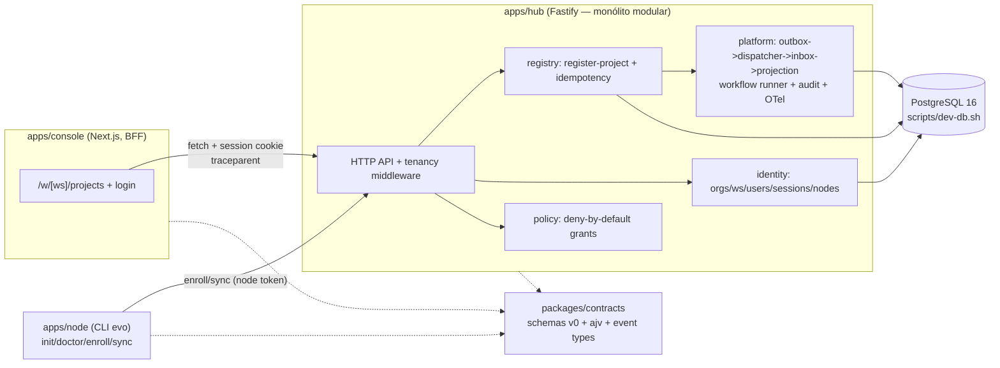

# Slice 0 — Trust Skeleton Design

**Spec**: `.specs/features/slice-0-trust-skeleton/spec.md`
**Status**: Approved (aprovação via "siga o plano"; abordagem A conforme ADRs aceitos)

---

## Constraints carregadas

- `.specs/STATE.md` Decisions: AD-001 (método spec-driven), AD-002 (slice como unidade), AD-003 (gate de docs) — todas ativas, nenhuma conflita.
- ADRs aceitos: ADR-001 (Hub+Node federado), ADR-002 (contratos abertos, local-first), ADR-003 (Next.js console/BFF; lógica authoritative fora do web runtime), ADR-004 (monólito modular + workers), ADR-005 (PostgreSQL source of record), ADR-006 (CloudEvents, outbox, durable workflows), ADR-014 (tenancy server-side, deny-by-default).
- Lessons confirmadas: nenhuma (L-001 é candidate; seu fix já foi aplicado em `validate_spec.py`).

## Abordagens consideradas

**A (escolhida): monorepo TypeScript pnpm — Hub Fastify + Console Next.js + Node CLI + contracts compartilhados.** Uma linguagem ponta a ponta; schemas v0 e tipos de evento num pacote único consumido por Hub, Node e Console; Hub é monólito modular com workers in-process (ADR-004); console nunca toca o banco (ADR-003).

**B (rejeitada): Next.js full-stack como Control Plane.** Route Handlers como lógica authoritative viola ADR-003 explicitamente ("Executar workflow agentic dentro de Route Handler" está em Rejeitado) e amarra outbox/workflows ao lifecycle do processo web.

**C (rejeitada): Hub em Python/FastAPI.** Duas linguagens duplicariam os contracts (schemas + tipos) e o custo de manutenção; nenhum requisito do M0 exige Python.

## Architecture Overview



Fluxo do walking skeleton (exit M0): form no console → BFF → `POST /projects` (Idempotency-Key, traceparent) → tx: insert `projects` + `outbox` → dispatcher publica → inbox dedup → projeção `projects_view` → `GET /projects` → UI.

## Code Reuse Analysis

Repositório é documental — não há código prévio. Reuso é de contratos e exemplos:

| Componente | Location | How to Use |
| --- | --- | --- |
| Exemplos YAML de manifests | `examples/*.yaml` | Fixtures de validação dos schemas v0 (TRUST-15/16) |
| Envelope/extensions de evento | `docs/07-specifications/06-event-contract-spec.md` | Fonte literal dos campos do schema `event.v0` |
| Taxonomia de event types | `docs/02-architecture/10-api-event-model.md` §5 | Constantes em `packages/contracts` |
| Regras de API | `docs/02-architecture/10-api-event-model.md` §3 | Problem Details, Idempotency-Key, Correlation-ID |

### Integration Points

| System | Integration Method |
| --- | --- |
| PostgreSQL 16 (local, sem systemd) | `scripts/dev-db.sh` roda `initdb`/`pg_ctl` como usuário `postgres` em socket unix + porta dedicada (provado no ambiente) |
| OTel | `@opentelemetry/sdk-trace-node` com exporter in-memory nos testes; `traceparent` W3C propagado console→hub e persistido na linha do outbox para continuar o trace no dispatcher/projeção |
| Playwright (chromium pré-instalado) | E2E do fluxo UI→projeção→UI |

## Components

### packages/contracts
- **Purpose**: Schemas v0 (project, evidence, proposal, decision, event) + validadores ajv + tipos TS + constantes de event types.
- **Location**: `packages/contracts/`
- **Interfaces**: `validateProject(data)`, `validateEvent(data)`, … (um por schema, retornando `{ok, errors}`); `EVENT_TYPES.PROJECT_REGISTERED`.
- **Dependencies**: ajv (+ ajv-formats), js-yaml (fixtures).
- **Reuses**: specs 01/03/04 de `docs/07-specifications`, event contract §2/§8.

### apps/hub — identity
- **Purpose**: Orgs, workspaces, users, sessions (dev identity), node agents; middleware de tenancy que deriva escopo da sessão no servidor (ADR-014 — nunca do payload).
- **Location**: `apps/hub/src/identity/`
- **Interfaces**: `POST /auth/dev-login` → cookie/token HMAC com `{userId, orgId, workspaceId}`; `requireSession(req)`; `POST /nodes/enroll` → node token.
- **Dependencies**: platform/db.
- **Reuses**: —

### apps/hub — policy
- **Purpose**: Deny-by-default: `check(scope, capability, resource)` consulta grants explícitos; toda negação gera auditoria.
- **Location**: `apps/hub/src/policy/`
- **Interfaces**: `checkCapability(scope, cap): Allow|Deny{reason}`.
- **Dependencies**: platform/db (tabela `capability_grants`), platform/audit.

### apps/hub — registry
- **Purpose**: Comando `register project` transacional: valida manifest mínimo (schema v0), insere `projects`, grava `outbox` na MESMA transação, aplica idempotência.
- **Location**: `apps/hub/src/registry/`
- **Interfaces**: `POST /projects` (Idempotency-Key obrigatório) → 201 receipt `{projectId, version}` | 200 replay | 409 conflito de key; `GET /projects` lê `projects_view`.
- **Dependencies**: contracts, identity, policy, platform.

### apps/hub — platform
- **Purpose**: Pool pg + migrations SQL; outbox dispatcher (poll → router in-process); inbox dedup; projetor `projects_view`; workflow runner durável (hello path com checkpoints); audit log; OTel.
- **Location**: `apps/hub/src/platform/`
- **Interfaces**: `withTx(fn)`, `enqueueOutbox(tx, event)`, `runDispatcherOnce()`, `runWorkflowsOnce()`, `startWorkers()/stopWorkers()` (loops chamam os `runOnce` — testes usam os `runOnce` determinísticos).
- **Dependencies**: pg, contracts, telemetry.

### apps/node — CLI `evo`
- **Purpose**: `init` (config local), `doctor` (config + alcance do Hub), `enroll` (registra Node, guarda token), `sync` (envia artefato dummy com digest sha256).
- **Location**: `apps/node/`
- **Interfaces**: CLI commander; fala apenas HTTP com o Hub (ADR-001).
- **Dependencies**: contracts.

### apps/console — Next.js shell
- **Purpose**: Shell autenticado: login dev, lista de projetos (Server Component lendo o Hub) e form de registro (mutation via BFF com Idempotency-Key + traceparent). Sem acesso a banco, sem policy no client (ADR-003/011-nextjs).
- **Location**: `apps/console/`
- **Interfaces**: rotas `/login`, `/w/[workspaceId]/projects`; Route Handler BFF `POST app/api/projects`.
- **Dependencies**: hub HTTP API.

### scripts/dev-db.sh
- **Purpose**: `start|stop|status|reset` de um cluster Postgres 16 local (initdb como usuário `postgres`, socket unix, porta 55432), exportando `DATABASE_URL`.
- **Location**: `scripts/dev-db.sh`

## Data Models (SQL v0 — migrations em `apps/hub/migrations/`)

```sql
organizations(id, name, created_at)
workspaces(id, org_id, name, created_at)
users(id, org_id, email, display_name, created_at)
node_agents(id, org_id, workspace_id, name, token_hash, enrolled_at, revoked_at)
node_artifacts(id, node_id, org_id, workspace_id, name, digest, received_at)
projects(id, org_id, workspace_id, type, name, manifest jsonb, version int, created_by, created_at)
capability_grants(id, org_id, workspace_id, principal, capability, created_at)
idempotency_keys(org_id, key, request_digest, response jsonb, created_at, PK(org_id, key))
outbox(seq, event_id, type, subject, tenant_id, workspace_id, project_id,
       correlation_id, causation_id, traceparent, classification,
       payload jsonb, occurred_at, dispatched_at)
inbox(consumer, event_id, processed_at, PK(consumer, event_id))
projects_view(project_id, org_id, workspace_id, name, type, registered_at)
workflows(id, type, status, current_step, checkpoint jsonb, org_id, updated_at)
workflow_steps(workflow_id, step, executed_at, PK(workflow_id, step))
audit_log(id, org_id, actor, action, resource, outcome, reason, correlation_id, at)
```

**Relationships**: tudo tenant-scoped por `org_id` (+ `workspace_id`); toda query passa pelo escopo derivado da sessão. `projects.version` para optimistic concurrency futura. `workflow_steps` é a prova de não-repetição pós-restart (TRUST-11).

## Error Handling Strategy

| Error Scenario | Handling | User Impact |
| --- | --- | --- |
| Sem sessão / token inválido | 401 Problem Details | Console redireciona a /login |
| Recurso de outro tenant | 403 + audit entry (nunca 404 vazando existência? — 403 genérico sem detalhes do recurso) | "Access denied" com correlation id |
| Capability sem grant | 403 `capability_denied` + audit | idem |
| Idempotency-Key ausente em command | 422 Problem Details | Form reenvia com key |
| Key reusada com digest diferente | 409 `idempotency_conflict` | Erro explícito no console |
| Manifest inválido (schema v0) | 422 com erros do ajv | Erros de campo no form |
| Dispatcher fora do ar | Evento fica em `outbox` (dispatched_at NULL); entregue após retomada | Projeção atrasa; UI mostra estado da projeção |
| Entrega duplicada ao consumer | Inbox dedup → no-op | Nenhum |
| Workflow morto pós-checkpoint | Runner retoma do checkpoint; `workflow_steps` impede repetição | Nenhum |
| Node sem enroll tenta sync | 401 Problem Details | CLI mostra "not enrolled" |

## Risks & Concerns

| Concern | Location | Impact | Mitigation |
| --- | --- | --- | --- |
| Container sem systemd; Postgres só roda como usuário `postgres` | `scripts/dev-db.sh` | Dev/CI quebram se assumirem serviço | Script provado no ambiente (initdb+pg_ctl+socket unix); documentado no README do app |
| Trace através do outbox não é continuação síncrona | `apps/hub/src/platform/outbox.ts` | Spans de projeção podem cair fora do trace | Persistir `traceparent` na linha do outbox e criar spans do dispatcher/projeção como filhos remotos desse contexto; teste TRUST-10 assere trace_id único |
| Next.js + Playwright pesados no sandbox | `apps/console` | Install/build lentos | Deps mínimas (sem UI kit); chromium pré-instalado (`PLAYWRIGHT_BROWSERS_PATH`); e2e em gate `full` apenas |
| Engine de workflow própria pode virar débito | `apps/hub/src/platform/workflow.ts` | Reescrita futura | Interface mínima (`defineWorkflow/steps`) mantida como adapter — ADR-006 prevê engine menor no Lite com interface preservada |
| Digest de idempotência precisa ser canônico | `apps/hub/src/registry/` | Falso conflito/replay | JSON canonicalizado (chaves ordenadas) + sha256; testes cobrem ambos os lados |

## Tech Decisions (only non-obvious ones)

| Decision | Choice | Rationale |
| --- | --- | --- |
| Linguagem/monorepo | TypeScript + pnpm workspaces (`apps/*`, `packages/*`) | Contracts compartilhados; console já é Next.js; uma toolchain (→ AD-004) |
| HTTP framework do Hub | Fastify | Leve, schema-friendly, sem lock-in de framework de app |
| Banco dev/test | PostgreSQL 16 real via `scripts/dev-db.sh` | ADR-005 pede Postgres; provado no container; SQLite/PGlite divergiriam de dialeto (→ AD-005) |
| Workflow M0 | Engine durável mínima própria sobre Postgres | ADR-006 permite engine menor com interface mantida; Temporal etc. é peso indevido no M0 (→ AD-006) |
| Migrations | Arquivos SQL sequenciais + runner próprio (tabela `schema_migrations`) | Zero dependência extra; suficiente para M0 |
| Validação de payloads | ajv contra os JSON Schemas v0 do contracts | O schema É o contrato (ADR-002); nada de validação duplicada à mão |
| Testes | vitest (unit/integration) + @playwright/test (e2e) | vitest cobre TS nativo; chromium já presente |
| Dev identity | `POST /auth/dev-login` emitindo token HMAC (org+workspace fixos seed) | Deliverable M0 "OIDC/dev identity"; OIDC real é slice futuro |

> Decisões AD-004..006 registradas em `.specs/STATE.md`.

---

## Review do slice (checklist de `docs/06-delivery/05-build-sequence.md`)

| Pergunta | Resposta |
| --- | --- |
| Usuário entende o valor? | Sim — registrar um projeto no console e vê-lo chegar pela projeção demonstra o loop comando→evento→leitura com identidade e isolamento reais |
| O novo artifact está no knowledge model? | Projetos, eventos, workflows e artifacts de Node seguem o modelo do design; manifests validados pelos schemas v0 de `packages/contracts` |
| Evidence/decision lineage existe? | N/A neste slice (nasce no Slice 3); decisões de processo registradas em `.specs/STATE.md` (AD-001..006) |
| Policy e classification cobrem o fluxo? | Deny-by-default com grants explícitos + auditoria de negação; todo envelope carrega `classification` |
| Failure/retry/idempotency definidos? | Outbox at-least-once, inbox dedup, Idempotency-Key com digest canônico, retry de workflow — todos com teste de integração |
| Evals incluem negative cases? | Suites negativas: cross-tenant, token forjado, digest divergente, key em conflito, consumer falhando; evals de agente N/A (nenhum agente neste slice) |
| O profile Lite continua possível? | Sim — Hub single-process + Node CLI locais; SQLite não substitui Postgres (AD-005), Lite usa o cluster local de `dev-db.sh` |
| Alguma hipótese do ecossistema foi invalidada? | Não; a taxonomia de eventos documentada foi confirmada e adotada literalmente |
