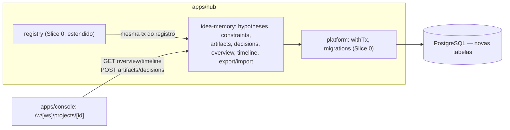

# Slice 1 — Idea Memory Design

**Spec**: `.specs/features/slice-1-idea-memory/spec.md`
**Status**: Approved (aprovação via "siga o plano"; extensão direta do Hub do Slice 0, sem novo ADR)

---

## Constraints carregadas

- `.specs/STATE.md` Decisions: AD-001..006 ativas — monorepo TS/pnpm, Postgres real, workflow engine própria, gate de docs, derivação por slice. Nenhuma conflita; este slice as estende (novas tabelas no mesmo Postgres, mesmo Hub Fastify).
- ADRs aceitos relevantes: ADR-005 (relacional como source of record — entidades tipadas, não JSON blob), ADR-009 (evidence-first — mas evidence real só entra no Slice 3; aqui aplicamos apenas a separação declared/observed via `authority`), ADR-014 (tenancy server-side).
- Lessons confirmadas: nenhuma (L-001, L-002 seguem `candidate`).

## Abordagem

Extensão direta do `apps/hub` existente — sem novo serviço, sem nova linguagem. As entidades do knowledge model (Hypothesis, Constraint, Artifact, ArtifactVersion, Decision) viram tabelas Postgres com FK para `projects`, seguindo o mesmo padrão de `withTx`/migrations/Problem Details já provado no Slice 0. Nenhuma abordagem alternativa foi avaliada — a única decisão real (armazenamento tipado vs. JSONB) já está resolvida por ADR-005 e pela rejeição explícita de "JSON blobs sem relações tipadas".

## Architecture Overview



Fluxo do registro estendido: `POST /projects` (Slice 0) agora, na MESMA transação, insere `hypotheses` e `constraints` a partir de `spec.hypotheses`/`spec.constraints` do manifest — nenhum novo endpoint de registro, apenas mais efeito colateral atômico. Artifacts e decisions ganham endpoints próprios porque acontecem depois do registro, ao longo da vida do projeto.

## Code Reuse Analysis

| Componente | Location | How to Use |
| --- | --- | --- |
| `withTx`, `runMigrations` | `apps/hub/src/platform/db.ts` (Slice 0) | Reusado sem alteração para todas as novas escritas |
| `problem`, `requireScope` | `apps/hub/src/http.ts` (Slice 0) | Mesmo padrão de erro/auth em todas as novas rotas |
| `enforceCapability`, `recordAudit` | `apps/hub/src/policy/policy.ts` (Slice 0) | Novas capabilities (`project.overview.read`, `artifact.write`, `decision.write`) seguem o mesmo deny-by-default |
| `validateProject` (schema v0) | `packages/contracts` (Slice 0) | Estendido para aceitar `spec.hypotheses`/`spec.constraints` já documentados no manifest spec — o schema já tinha `constraints`; falta `hypotheses` |
| `registerProject` | `apps/hub/src/registry/registry.ts` (Slice 0) | Estendido para persistir hipóteses/constraints dentro da mesma `withTx` existente |
| Console BFF pattern (`app/api/*/route.ts`) | `apps/console` (Slice 0) | Reusado para os novos BFFs (artifacts, decisions) |

### Integration Points

| System | Integration Method |
| --- | --- |
| PostgreSQL (mesmo cluster do Slice 0) | Migration `002_idea_memory.sql` |
| Console | Nova rota `/w/[workspaceId]/projects/[projectId]` (Server Component agregando overview) |

## Components

### packages/contracts — schema v0 estendido
- **Purpose**: Adicionar `spec.hypotheses[]` ao `project.v0.json` (o manifest spec já o define; o schema do Slice 0 ainda não).
- **Location**: `packages/contracts/src/schemas/project.v0.json`
- **Reuses**: estrutura de `spec.constraints` já existente como modelo de shape.

### apps/hub — idea-memory/hypotheses
- **Purpose**: Persistir e listar hipóteses; detectar ID duplicado dentro do manifest antes do insert.
- **Location**: `apps/hub/src/idea-memory/hypotheses.ts`
- **Interfaces**: `insertHypotheses(client, projectId, hypotheses[])` (usado dentro da tx de registro); `GET /projects/:id/hypotheses`.
- **Dependencies**: platform/db, registry (chamado de dentro de `registerProject`).

### apps/hub — idea-memory/constraints
- **Purpose**: Mesmo padrão para constraints.
- **Location**: `apps/hub/src/idea-memory/constraints.ts`
- **Interfaces**: `insertConstraints(client, projectId, constraints[])`; incluído na resposta do overview (sem endpoint de listagem próprio — YAGNI, o overview já cobre o AC).

### apps/hub — idea-memory/artifacts
- **Purpose**: Anexar artifact (v1) e adicionar novas versões preservando histórico.
- **Location**: `apps/hub/src/idea-memory/artifacts.ts`
- **Interfaces**: `POST /projects/:id/artifacts` (cria v1); `POST /projects/:id/artifacts/:artifactId/versions` (append); `GET /projects/:id/artifacts` (lista com versão atual + count); `GET /projects/:id/artifacts/:artifactId/versions/:version` (versão específica).
- **Dependencies**: platform/db, policy.

### apps/hub — idea-memory/decisions
- **Purpose**: Registrar decisão com rationale/alternatives/review trigger; ao registrar, buscar decisões anteriores sobre o mesmo `subjectRef` (hypothesis/artifact) e retorná-las junto (guard).
- **Location**: `apps/hub/src/idea-memory/decisions.ts`
- **Interfaces**: `POST /projects/:id/decisions` → `{decision, priorRelatedDecisions[]}`; `GET /projects/:id/decisions`.
- **Dependencies**: platform/db, policy; valida que `subjectRef` (quando presente) pertence ao mesmo projeto.

### apps/hub — idea-memory/overview
- **Purpose**: Agregar identidade + intent + hipóteses + constraints + contagens de artifacts/decisions numa única query.
- **Location**: `apps/hub/src/idea-memory/overview.ts`
- **Interfaces**: `GET /projects/:id/overview`.
- **Dependencies**: lê `projects`, `hypotheses`, `constraints`, `artifacts`, `decisions` diretamente (read model simples, sem projeção assíncrona — leitura síncrona é aceitável aqui pois não há fan-out de consumers, ao contrário do outbox).

### apps/hub — idea-memory/timeline
- **Purpose**: União ordenada de hypothesis status changes, artifact version events e decisions.
- **Location**: `apps/hub/src/idea-memory/timeline.ts`
- **Interfaces**: `GET /projects/:id/timeline` → array `{occurredAt, kind, summary, ref}` desc, limitado a 200.

### apps/hub — idea-memory/export-import
- **Purpose**: Serializar projeto completo para manifest portável; recriar a partir de um export preservando IDs.
- **Location**: `apps/hub/src/idea-memory/export-import.ts`
- **Interfaces**: `GET /projects/:id/export`; `POST /projects/import`.
- **Dependencies**: reusa `validateProject` do contracts para validar o export antes de servir; import roda em uma única `withTx` (tudo ou nada).

### apps/console — Project Overview page
- **Purpose**: Renderizar overview + timeline; forms simples para artifact/decision.
- **Location**: `apps/console/app/w/[workspaceId]/projects/[projectId]/page.tsx`
- **Dependencies**: hub HTTP API via BFF, mesmo padrão do Slice 0.

## Data Models (SQL — `apps/hub/migrations/002_idea_memory.sql`)

```sql
hypotheses(id text PK, project_id, org_id, workspace_id, statement, type,
           evidence_state, metric, threshold, status, authority default 'declared', created_at)
constraints(id text PK, project_id, org_id, workspace_id, category, statement,
            severity, authority default 'declared', created_at)
artifacts(id text PK, project_id, org_id, workspace_id, type, title, current_version int, created_at)
artifact_versions(artifact_id, version int, reference, content, created_at, PK(artifact_id, version))
decisions(id text PK, project_id, org_id, workspace_id, decision, actor, rationale,
          alternatives jsonb, subject_type, subject_id, review_trigger, review_trigger_status
          default 'none', decided_at)
```

**Relationships**: `hypotheses.id`/`constraints.id`/`artifacts.id`/`decisions.id` vêm do manifest ou são gerados (`hyp_`/`con_`/`art_`/`dec_` + ULID-like), sempre com `project_id` FK. `decisions.subject_id` referencia `hypotheses.id` ou `artifacts.id` (validado pertencer ao mesmo `project_id`). Todas as tabelas herdam `org_id`/`workspace_id` diretamente (denormalizado) para permitir o mesmo padrão de policy/tenancy sem join extra — consistente com `projects_view` do Slice 0.

## Error Handling Strategy

| Error Scenario | Handling | User Impact |
| --- | --- | --- |
| Hipótese duplicada no manifest | 422 `duplicate_hypothesis_id`, nenhuma linha gravada (rollback da tx de registro) | Form mostra o ID duplicado |
| Artifact version sem reference/content | 422 `invalid_artifact_version` | Form mostra erro |
| Decision referenciando subject de outro projeto | 422 `invalid_subject_reference` | Form mostra erro |
| Import com ID de tenant já existente | 409 `import_conflict` | Console mostra "projeto já existe" |
| Overview/timeline cross-tenant | 403 `access_denied` + audit (mesmo padrão TRUST-07) | Mensagem genérica |

## Risks & Concerns

| Concern | Location | Impact | Mitigation |
| --- | --- | --- | --- |
| Overview faz 5 queries síncronas (N+1 potencial em escala) | `apps/hub/src/idea-memory/overview.ts` | Latência cresce com portfólio grande | Aceitável no M1 (um projeto por vez); revisão de performance é sinal de extração explícito (ADR-004 review triggers), não problema deste slice |
| `decisions.alternatives` como jsonb sem schema tipado | `apps/hub/migrations/002_idea_memory.sql` | Alternativas mal-formadas não são pegas por schema | Mitigado por validação de shape na camada de aplicação (array de objetos com `id`/`title`); jsonb evita nova tabela para um campo de profundidade variável, custo aceito |
| Import falho a meio caminho deixaria dados órfãos | `apps/hub/src/idea-memory/export-import.ts` | Projeto parcialmente criado | Import inteiro roda em uma `withTx`; qualquer falha reverte tudo (mesmo padrão comprovado em `registerProject`) |

## Tech Decisions (only non-obvious ones)

| Decision | Choice | Rationale |
| --- | --- | --- |
| Versionamento de artifact | Append-only por linha (sem diff) | Simplicidade; reversível a qualquer momento lendo a versão exata; nenhum requisito pede diff |
| Overview é leitura síncrona direta, não projeção | Query direta às tabelas, sem outbox/projection | Não há fan-out de consumers como no registro (Slice 0); projeção assíncrona seria complexidade sem propósito aqui |
| IDs de hipótese/constraint/artifact/decision | Usa o ID do manifest quando presente; gera um novo (`hyp_<ulid>` etc.) quando ausente | Manifest spec permite IDs client-side para hipóteses/constraints; import precisa preservá-los exatamente (IDEA-18) |

Nenhuma decisão aqui atinge o critério de projeto-level (não é hard-to-reverse nem cross-feature) — todas ficam nesta tabela, sem novo AD-NNN.
