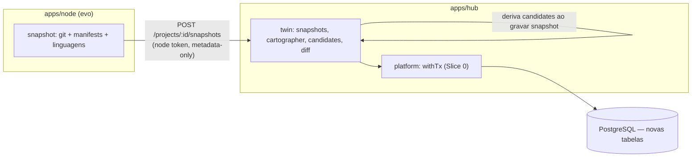

# Slice 2 — Local Repo Twin Design

**Spec**: `.specs/features/slice-2-local-repo-twin/spec.md`
**Status**: Approved (aprovação via "siga o plano"; extensão direta do Hub e do Node do Slice 0/1)

---

## Constraints carregadas

- `.specs/STATE.md` Decisions: AD-001..006 ativas. Nenhuma conflita; este slice estende o mesmo Hub/Node.
- ADRs relevantes: ADR-001 (Node fala só HTTP com o Hub), ADR-005 (entidades tipadas), ADR-009 (authority explícita: aqui `observed`/`inferred` entram pela primeira vez ao lado de `declared`), ADR-015 (código local por padrão — snapshot é metadata-only).
- Lessons confirmadas: nenhuma.

## Abordagem

Extensão direta de `apps/node` (novo comando `snapshot`) e `apps/hub` (novo domínio `twin`: snapshots, candidates, diff). Nenhuma abordagem alternativa foi avaliada para a arquitetura geral — a decisão de escopo real (Cartographer determinístico vs. agente LLM) já está resolvida no spec (Out of Scope) por falta de infra agentic; a decisão de design real aqui é COMO representar `observed`/`inferred` sem duplicar o modelo de `declared` (hypotheses/constraints do Slice 1).

## Architecture Overview



Fluxo: `evo snapshot` coleta localmente (nunca envia arquivo) → `POST /projects/:id/snapshots` autenticado por node token (mesmo padrão de `POST /nodes/:id/artifacts` do Slice 0) → Hub grava o snapshot e, na MESMA transação, roda o Cartographer determinístico contra o payload para propor candidates → humano confirma/rejeita via `PATCH` de status → diff é uma leitura comparando o manifest declarado do projeto com o snapshot mais recente.

## Code Reuse Analysis

| Componente | Location | How to Use |
| --- | --- | --- |
| Autenticação por node token | `apps/hub/src/nodes/routes.ts` (Slice 0) | Mesmo padrão de header `x-node-token` + hash para o novo endpoint de snapshot |
| `withTx`, `requireOwnedProject`, `enforceCapability` | Slice 0/1 | Reusados sem alteração |
| Padrão `insertX`/`listX` por domínio | `apps/hub/src/idea-memory/*` (Slice 1) | Mesmo padrão aplicado a `twin/snapshots.ts`, `twin/candidates.ts` |
| CLI commander + config local | `apps/node/src/cli.ts`, `config.ts` (Slice 0) | Novo comando `snapshot` reusa `loadConfig`/`hubFetch` |
| `authority` como coluna | `hypotheses`/`constraints_` (Slice 1) | Estendido para `declared|observed|inferred` (era só `declared` até aqui) |

### Integration Points

| System | Integration Method |
| --- | --- |
| PostgreSQL | Migration `003_twin.sql` |
| Node CLI | Coleta local via `simple-git`-like leitura direta de `.git/` (sem shell out a `git`, para não depender do binário estar no PATH do ambiente do usuário) + leitura de manifests conhecidos no filesystem |

## Components

### apps/node — snapshot collector
- **Purpose**: Coletar branch/HEAD sha do `.git` local, detectar manifests de pacote conhecidos, montar histograma de linguagens por extensão; nunca ler conteúdo de código-fonte além dos próprios manifests (só os campos `name`/`type` deles, não o arquivo inteiro).
- **Location**: `apps/node/src/snapshot.ts`
- **Interfaces**: `collectSnapshot(repoPath): SnapshotPayload | {error}`; comando `evo snapshot [--path]`.
- **Dependencies**: leitura de filesystem/`.git` puro (sem dependência de binário git externo).

### apps/hub — twin/snapshots
- **Purpose**: Persistir snapshot versionado (`authority='observed'`) e disparar o Cartographer na mesma transação.
- **Location**: `apps/hub/src/twin/snapshots.ts`
- **Interfaces**: `POST /projects/:id/snapshots` (auth por node token); `GET /projects/:id/snapshots`.
- **Dependencies**: platform/db, twin/cartographer.

### apps/hub — twin/cartographer
- **Purpose**: Regras determinísticas: >1 manifest → propõe 1 `component` + 1 relação `contains` por manifest, evitando duplicar candidate pendente para a mesma localização.
- **Location**: `apps/hub/src/twin/cartographer.ts`
- **Interfaces**: `proposeCandidates(client, projectId, snapshot): CandidateInput[]` (chamado de dentro da tx do snapshot).
- **Dependencies**: nenhuma externa — puro determinístico.

### apps/hub — twin/candidates
- **Purpose**: Listar candidates; confirmar (promove a `declared`, preserva o `inferred`); rejeitar (preserva registro); guard de reaparecimento sem evidência nova.
- **Location**: `apps/hub/src/twin/candidates.ts`
- **Interfaces**: `GET /projects/:id/candidates`; `POST /projects/:id/candidates/:candidateId/confirm`; `POST /projects/:id/candidates/:candidateId/reject`.
- **Dependencies**: platform/db, policy.

### apps/hub — twin/diff
- **Purpose**: Comparar manifest declarado (`projects.manifest`) com o snapshot mais recente e reportar divergências, sem alterar o declarado.
- **Location**: `apps/hub/src/twin/diff.ts`
- **Interfaces**: `GET /projects/:id/diff`.
- **Dependencies**: twin/snapshots (leitura do último snapshot).

## Data Models (SQL — `apps/hub/migrations/003_twin.sql`)

```sql
snapshots(id text PK, project_id, org_id, workspace_id, node_id, branch, commit_sha,
          manifests jsonb, languages jsonb, observed_at timestamptz, created_at)
candidates(id text PK, project_id, org_id, workspace_id, snapshot_id, kind
           ('component'|'contains'), location text, payload jsonb, status
           ('pending'|'confirmed'|'rejected') default 'pending', reason text,
           confirmed_entity_id text, created_at, decided_at)
```

**Relationships**: `candidates.snapshot_id` referencia o snapshot que o originou; `candidates.location` (caminho relativo do manifest detectado) é a chave de deduplicação — um `pending` já existente na mesma `location` não é reproposto (TWIN-09); um `rejected` na mesma `location` só é reproposto se `payload` mudar (ecosystem/name diferentes) — checado por comparação de payload, não apenas location (TWIN-13). `confirmed_entity_id` aponta para o `component` promovido (armazenado como uma linha adicional em `artifacts` com `type='component'`, reusando a tabela já existente do Slice 1 em vez de criar uma nova tabela de "entidades genéricas" sem requisito que a justifique).

## Error Handling Strategy

| Error Scenario | Handling | User Impact |
| --- | --- | --- |
| `evo snapshot` fora de repo Git | Falha local, nenhum HTTP request | CLI mostra erro claro, exit != 0 |
| `evo snapshot` sem enroll | 401 do Hub (mesmo padrão de `evo sync`) | CLI mostra "node is not enrolled" |
| Confirmar/rejeitar candidate não-pending | 409 `candidate_not_pending` | Nada muda |
| Candidate de outro projeto | 404 (mesmo padrão `requireOwnedProject`) | — |
| Diff sem snapshot algum | 200 com `observed: null`, não erro | UI mostra "sem dados observados ainda" |

## Risks & Concerns

| Concern | Location | Impact | Mitigation |
| --- | --- | --- | --- |
| Ler `.git/HEAD`/`.git/refs` manualmente é frágil (worktrees, packed-refs, detached HEAD) | `apps/node/src/snapshot.ts` | Branch/sha podem faltar em setups incomuns | Campos `branch`/`commitSha` viram opcionais (`null`) quando não resolvíveis, sem falhar o snapshot inteiro — o inventário de manifests/linguagens continua útil sozinho |
| Cartographer determinístico pode gerar candidates de baixo valor em monorepos com muitos manifests de teste/fixture | `apps/hub/src/twin/cartographer.ts` | Ruído para o usuário confirmar | Aceitável no M1 (produto ainda é "read-only, revisão humana"); filtro de diretórios (`node_modules`, `.git`, `dist`) é aplicado na coleta do Node, não do Hub |
| `confirmed_entity_id` reusando `artifacts` para "component" mistura conceitos (artifact = evidência declarada, component = entidade arquitetural) | `apps/hub/migrations/003_twin.sql` | Confusão semântica futura | Aceito conscientemente para não criar uma tabela "entities" genérica sem um segundo caso de uso real; revisitar quando Slice 3+ trouxer mais tipos de entidade do knowledge model |

## Tech Decisions (only non-obvious ones)

| Decision | Choice | Rationale |
| --- | --- | --- |
| Leitura de Git | Parse manual de `.git/HEAD` + `.git/refs`/`packed-refs` (sem shell out) | Evita dependência do binário `git` estar instalado/no PATH do ambiente de quem roda `evo`; suficiente para branch+sha |
| Dedup de candidates | Por `(project_id, location)` comparando `payload` | Location é estável entre snapshots; payload muda só quando o manifest realmente muda |
| Confirmação promove para `artifacts` (`type='component'`) | Reuso da tabela do Slice 1 | Evita nova tabela "entities" sem segundo caso de uso comprovado (YAGNI) |

Nenhuma decisão aqui atinge o critério de projeto-level — todas ficam nesta tabela.
