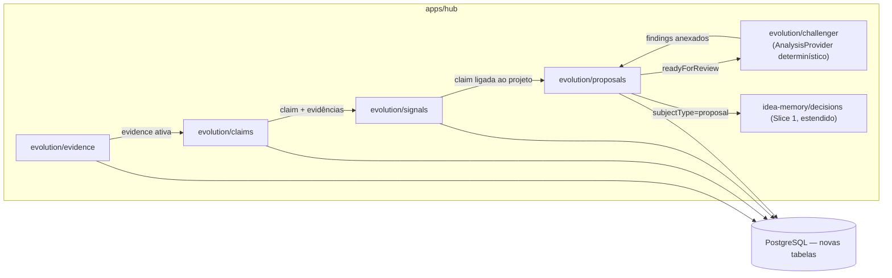

# Slice 3 — Evidence to Decision Design

**Spec**: `.specs/features/slice-3-evidence-to-decision/spec.md`
**Status**: Approved (aprovação via "siga o plano")

---

## Constraints carregadas

- `.specs/STATE.md` Decisions: AD-001..006 ativas. Nenhuma conflita; este slice estende o mesmo Hub.
- ADRs relevantes: ADR-006 (outbox/eventos — não usado aqui, análise é síncrona por design), ADR-009 (evidence-first, estados epistêmicos), ADR-010 (autonomia progressiva — decisão de proposal usa o mesmo capability grant, sem autonomia automática ainda), ADR-013 (provider adapters — cumprido pela interface `AnalysisProvider`, adapter determinístico).
- Lessons confirmadas: nenhuma.

## Abordagem

Novo domínio `apps/hub/src/evolution/` (evidence, claims, signals, proposals, challenger) seguindo o mesmo padrão `insertX`/`listX`/`withTx` provado nos Slices 1-2. A decisão real de design é a interface `AnalysisProvider` — um ponto de extensão único para Specialist e Challenger que hoje tem apenas o adapter determinístico, mas não exige reescrever call sites quando um provider real (LLM) existir.

**Alternativa considerada e rejeitada**: implementar Specialist/Challenger como chamadas diretas embutidas em cada rota (sem interface). Rejeitada porque o próprio ADR-013 exige "provider adapters" — a interface é barata agora e evita um refactor maior no Slice 6.

## Architecture Overview



Fluxo do vertical slice do `AGENTS.md`: evidência (quarantine→active) → claim (statement+epistemicType+evidências) → signal (claim×projeto, relevância decomposta) → proposal (a partir do signal, com alternativas) → Challenger (síncrono, ao mover a readyForReview) → inbox (`GET /projects/:id/proposals?status=readyForReview`) → decisão (`POST /projects/:id/decisions` já existente, `subjectType=proposal`) → guard de rejeição (já genérico desde o Slice 1).

## Code Reuse Analysis

| Componente | Location | How to Use |
| --- | --- | --- |
| `withTx`, `requireOwnedProject`, `enforceCapability` | Slices 0-2 | Reusados sem alteração em todas as novas rotas |
| `decisions.ts` (`recordDecision`, `listDecisions`, `SUBJECT_TABLE`) | `apps/hub/src/idea-memory/decisions.ts` (Slice 1) | Estendido: `SUBJECT_TABLE.proposal = 'proposals'`; nenhum novo endpoint de decisão — o guard de rejeição já funciona genericamente |
| Padrão `insertX`/`listX` | Slices 1-2 | Aplicado a evidence/claims/signals/proposals |
| Padrão de proposer determinístico (`proposeFromSnapshot`) | `apps/hub/src/twin/cartographer.ts` (Slice 2) | Modelo direto para o Challenger: função pura `(proposal, claims, evidence) => findings[]` |

### Integration Points

| System | Integration Method |
| --- | --- |
| PostgreSQL | Migration `004_evolution.sql` |

## Components

### apps/hub — evolution/evidence
- **Purpose**: Criar evidência em quarentena; ativar; listar.
- **Location**: `apps/hub/src/evolution/evidence.ts`
- **Interfaces**: `POST /projects/:id/evidence`; `POST /projects/:id/evidence/:evidenceId/activate`; `GET /projects/:id/evidence`.

### apps/hub — evolution/claims
- **Purpose**: Criar claim ligada a 1+ evidências ativas do mesmo projeto (tabela de junção `claim_evidence`); listar.
- **Location**: `apps/hub/src/evolution/claims.ts`
- **Interfaces**: `POST /projects/:id/claims`; `GET /projects/:id/claims`.

### apps/hub — evolution/signals
- **Purpose**: Ligar claim a projeto como signal; calcular `evidenceStrength`/`confidence` deterministicamente a partir dos metadados das evidências ligadas; dedup por `(project_id, claim_id)`.
- **Location**: `apps/hub/src/evolution/signals.ts`
- **Interfaces**: `POST /projects/:id/signals`; `GET /projects/:id/signals`.

### apps/hub — evolution/analysis-provider
- **Purpose**: Interface `AnalysisProvider` (ADR-013) + o único adapter deste slice, `deterministicProvider`, com duas funções puras: `scoreEvidence(evidenceList)` (usada por signals) e `challenge(proposal, claims, evidenceList)` (usada por proposals).
- **Location**: `apps/hub/src/evolution/analysis-provider.ts`
- **Dependencies**: nenhuma externa — puro determinístico, mesmo espírito do Cartographer.

### apps/hub — evolution/proposals
- **Purpose**: Criar proposal (draft); mover a `readyForReview` rodando o Challenger na mesma operação; listar (inbox filtra por status).
- **Location**: `apps/hub/src/evolution/proposals.ts`
- **Interfaces**: `POST /projects/:id/proposals`; `POST /projects/:id/proposals/:proposalId/ready`; `GET /projects/:id/proposals`.
- **Dependencies**: evolution/analysis-provider.

### apps/hub — idea-memory/decisions (extensão)
- **Purpose**: `SUBJECT_TABLE` ganha `proposal: 'proposals'`; nenhuma outra mudança — `recordDecision`/`listDecisions`/o guard de decisões relacionadas já funcionam para o novo subject type.
- **Location**: `apps/hub/src/idea-memory/decisions.ts`

## Data Models (SQL — `apps/hub/migrations/004_evolution.sql`)

```sql
evidence(id text PK, project_id, org_id, workspace_id, type
         ('humanStatement'|'referenceOnly'), status
         ('quarantine'|'active'|'source_unavailable') default 'quarantine',
         source_type, source_reference, source_authority, content_digest,
         content_excerpt, classification, created_at, activated_at)
claims(id text PK, project_id, org_id, workspace_id, statement,
       epistemic_type ('fact'|'inference'|'hypothesis'), created_at)
claim_evidence(claim_id, evidence_id, PK(claim_id, evidence_id))
signals(id text PK, project_id, org_id, workspace_id, claim_id,
        evidence_strength text, confidence text, created_at,
        UNIQUE(project_id, claim_id))
proposals(id text PK, project_id, org_id, workspace_id, signal_id, title,
          summary, why_now, cost_of_inaction, proposal_type, status
          ('draft'|'readyForReview'|'decided') default 'draft',
          alternatives jsonb, recommended_alternative_id, impact jsonb,
          challenger_findings jsonb default '[]'::jsonb, created_at, ready_at)
```

**Relationships**: `claim_evidence` é N:N (evidence spec §4). `signals` tem unique `(project_id, claim_id)` — o dedup de FLOW-11 é garantido no banco, não só na aplicação (mesmo padrão do índice único do Slice 2). `decisions.subject_id` referencia `proposals.id` quando `subject_type='proposal'` — reuso direto, sem nova coluna.

## Error Handling Strategy

| Error Scenario | Handling | User Impact |
| --- | --- | --- |
| Evidência sem fonte | 422 `invalid_evidence` | Form mostra erro |
| Claim referenciando evidência em quarentena | 422 `evidence_not_active` | — |
| Claim referenciando evidência de outro projeto | 422 `invalid_evidence_reference` | — |
| Claim sem evidência nenhuma | 422 `claim_requires_evidence` | — |
| Signal duplicado (mesma claim) | 200 retorna o signal existente (idempotente, não erro) | — |
| Proposal sem claims e sem investigation state | 422 `proposal_requires_evidence` | — |
| Decisão sobre proposal de outro projeto | 422 (guard já existente de `decisions.ts`) | — |

## Risks & Concerns

| Concern | Location | Impact | Mitigation |
| --- | --- | --- | --- |
| `evidenceStrength`/`confidence` determinísticos podem parecer mais rigorosos do que são (apenas contam fontes/autoridade) | `apps/hub/src/evolution/analysis-provider.ts` | Falsa sensação de rigor analítico | Documentado explicitamente como placeholder determinístico em Out of Scope da spec; troca por provider real é a extensão prevista |
| Challenger com checklist fixo pode não pegar todo anti-padrão do PRD-003 §8 | `apps/hub/src/evolution/analysis-provider.ts` | Cobertura parcial dos anti-padrões | Aceitável no M2 — cobre os 3 mais objetivamente detectáveis sem julgamento (do-nothing ausente, fonte única, custo de inação ausente); os demais (hype bias, causalidade) exigem julgamento real, fora de alcance determinístico |
| `impact`/`urgency`/`effort`/`risk` informados pelo humano sem validação de faixa | `apps/hub/src/evolution/proposals.ts` | Dados subjetivos sem constraint | Aceito conscientemente — são campos de julgamento, não fatos verificáveis; schema aceita string livre por dimensão neste slice |

## Tech Decisions (only non-obvious ones)

| Decision | Choice | Rationale |
| --- | --- | --- |
| Reuso de `decisions` para proposals | `SUBJECT_TABLE` ganha uma entrada, nenhuma tabela nova | O guard de rejeição já testado (IDEA-15/TWIN-11) funciona sem modificação — reescrever seria duplicar lógica comprovada |
| `AnalysisProvider` como interface, não classe/DI framework | Duas funções puras exportadas (`scoreEvidence`, `challenge`) | Simplicidade — nenhum requisito pede múltiplos providers simultâneos ainda; a interface é o contrato de tipos, não um sistema de plugins |
| Challenger roda síncrono na transição de status, não em background | `apps/hub/src/evolution/proposals.ts` | Determinístico e rápido o suficiente para não precisar de outbox/worker; revisitar se um provider real (latência de LLM) tornar isso inviável |

Nenhuma decisão aqui atinge o critério de projeto-level.
