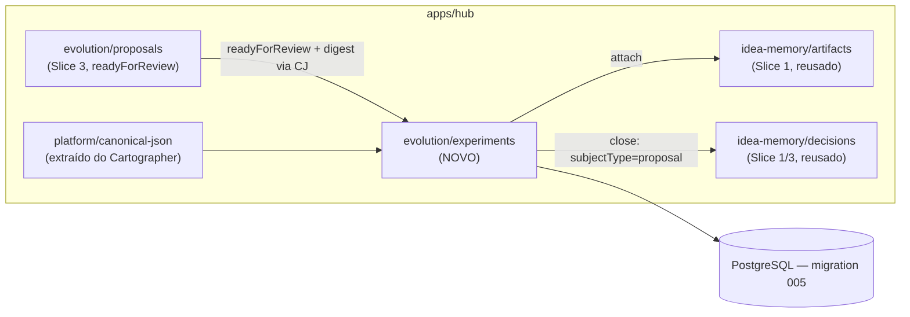

# Slice 4 — Experiment Loop Design

**Spec**: `.specs/features/slice-4-experiment-loop/spec.md`
**Status**: Approved

## Constraints carregadas

`.specs/STATE.md` Decisions AD-001..006 — todas ativas, nenhuma conflita: TS/pnpm monorepo (AD-004), Postgres real via `dev-db.sh` (AD-005), `tlc-spec-driven` como método único (AD-001), slices verticais do build-sequence como unidade de entrega (AD-002), docs-graph íntegro (AD-003), workflow durável mínimo (AD-006, não usado neste slice — o experimento é síncrono como o Challenger do Slice 3).

## Abordagem

Novo módulo `apps/hub/src/evolution/experiments.ts` seguindo o mesmo padrão `insertX`/`listX`/`withTx` dos Slices 1-3. A decisão real de design é extrair `canonicalJson` do Cartographer (Slice 2) para um util compartilhado, porque este slice precisa da mesma serialização estável para o digest da proposal — duplicar a função reintroduziria o risco que ela existe para evitar.

**Alternativa considerada e rejeitada**: computar o digest a partir do payload da requisição em vez de reler a proposal do banco. Rejeitada porque o digest deve provar o que foi de fato aprovado no banco no momento da decisão (proposal spec §5: "approval invalid if proposal/plan digest changes"), não o que o cliente alega ter visto — ler do banco é a fonte de verdade.

## Architecture Overview



Fluxo do vertical slice deste slice: proposal `readyForReview` (Slice 3) → iniciar experimento (2 variantes + plano de verificação + digest) → anexar proof artifacts (reuso do Slice 1) → avaliar deterministicamente (`hypothesis_met`/`hypothesis_not_met`/`inconclusive`) → fechar (decisão preservada via mecanismo genérico, proposal `closed`).

## Code Reuse Analysis

| Componente | Location | How to Use |
| --- | --- | --- |
| `withTx`, `requireOwnedProject`, `enforceCapability` | Slices 0-3 | Reusados sem alteração em todas as novas rotas |
| `canonicalJson` (hoje privada em `cartographer.ts`) | `apps/hub/src/twin/cartographer.ts:44` | Extraída para `apps/hub/src/platform/canonical-json.ts`; `cartographer.ts` passa a importar do novo local (sem mudança de comportamento) |
| `createArtifact`/`listArtifacts` | `apps/hub/src/idea-memory/artifacts.ts` (Slice 1) | Reusado sem alteração — o cliente cria o artifact pelo endpoint já existente; este slice só liga um artifact existente a um experimento |
| `recordDecision`/`listDecisions` (`SUBJECT_TABLE`) | `apps/hub/src/idea-memory/decisions.ts` (Slice 1/3) | Reusado sem alteração — o fechamento do experimento chama `recordDecision` com `subjectType='proposal'`, igual ao Slice 3 |
| Padrão `insertX`/`listX` com `withTx` | Slices 1-3 | Aplicado a `experiments`/`experiment_artifacts` |
| Padrão de função pura determinística | `apps/hub/src/evolution/analysis-provider.ts` (Slice 3) | Modelo direto para `evaluateExperiment(plan, observedValue) => {verdict, rationale}` |
| Padrão de link N:N idempotente | `apps/hub/src/evolution/signals.ts` (`ON CONFLICT DO NOTHING`, Slice 3) | Aplicado ao attach de proof artifacts (edge case: mesmo artifact anexado duas vezes não duplica) |

### Integration Points

| System | Integration Method |
| --- | --- |
| PostgreSQL | Migration `005_experiments.sql` |

## Components

### apps/hub — platform/canonical-json (extração)

- **Purpose**: Serialização JSON com chaves ordenadas, estável através de round-trips do Postgres jsonb.
- **Location**: `apps/hub/src/platform/canonical-json.ts`
- **Interfaces**: `canonicalJson(value: unknown): string`
- **Dependencies**: nenhuma.
- **Reuses**: extraída de `apps/hub/src/twin/cartographer.ts:44-52` byte-a-byte; `cartographer.ts` importa a versão extraída, `payloadEquals` local não muda de comportamento.

### apps/hub — evolution/experiments

- **Purpose**: Iniciar experimento (digest + 2 variantes + plano de verificação) a partir de uma proposal `readyForReview`; anexar/listar proof artifacts; avaliar deterministicamente; fechar com decisão preservada.
- **Location**: `apps/hub/src/evolution/experiments.ts`
- **Interfaces**: `POST /projects/:id/proposals/:proposalId/experiments`; `POST /projects/:id/experiments/:experimentId/artifacts`; `GET /projects/:id/experiments/:experimentId/artifacts`; `POST /projects/:id/experiments/:experimentId/evaluate`; `POST /projects/:id/experiments/:experimentId/close`; `GET /projects/:id/experiments/:experimentId`.
- **Dependencies**: `platform/canonical-json`, `evolution/analysis-provider`-style pure function (`evaluateExperiment`), `idea-memory/decisions`.

## Data Models (SQL — `apps/hub/migrations/005_experiments.sql`)

```sql
experiments(id text PK, project_id, org_id, workspace_id,
            proposal_id text references proposals(id),
            proposal_digest text not null,
            variants jsonb not null,               -- exactly 2 at insert time (app-level check)
            verification_plan jsonb not null,       -- {hypothesis, baselineMetric, threshold, comparison, observationWindow}
            environment jsonb not null default '{}'::jsonb,
            status text not null default 'running', -- running | evaluated | closed
            observed_value jsonb,                   -- number or null, set at evaluate
            verdict text,                           -- hypothesis_met | hypothesis_not_met | inconclusive
            verdict_rationale text,
            created_at timestamptz not null default now(),
            evaluated_at timestamptz,
            closed_at timestamptz)
experiment_artifacts(experiment_id text references experiments(id),
                      artifact_id text references artifacts(id),
                      PRIMARY KEY (experiment_id, artifact_id))
```

**Relationships**: `experiments.proposal_id` referencia `proposals.id` (1 proposal pode ter no máximo um experimento `running` por vez — não há unique index forçando isso porque a spec não pede reexperimentação nesta fatia; a checagem "proposal precisa estar `readyForReview`" já impede iniciar um segundo enquanto o primeiro está em andamento, já que a proposal sai de `readyForReview` assim que o primeiro experimento começa). `experiment_artifacts` é N:N (mesmo padrão de `claim_evidence`).

## Error Handling Strategy

| Error Scenario | Handling | User Impact |
| --- | --- | --- |
| Variantes != 2 | 422 `invalid_variants` | — |
| Plano de verificação incompleto | 422 `invalid_verification_plan` | — |
| Proposal não está `readyForReview` ao iniciar experimento | 409 `invalid_transition` | — |
| Artifact de outro projeto anexado | 422 `invalid_artifact_reference` | — |
| Avaliação sem o campo de valor observado | 422 `invalid_observation` | — |
| Avaliação de experimento não `running` | 409 `invalid_transition` | — |
| Fechamento de experimento não `evaluated` | 409 `invalid_transition` | — |
| Experimento inexistente | 404 `not_found` | — |

## Risks & Concerns

| Concern | Location | Impact | Mitigation |
| --- | --- | --- | --- |
| `canonicalJson` extraído precisa manter exatamente o mesmo comportamento para não quebrar `payloadEquals` do Slice 2 (TWIN-13, dedup de candidates) | `apps/hub/src/twin/cartographer.ts` | Regressão silenciosa no dedup de candidates se a extração mudar semântica | Extração byte-a-byte (copy, not rewrite); a suíte de testes existente do Slice 2 (`candidates.test.ts`, `diff.test.ts`) roda no gate deste slice e cobre a regressão |
| Sem unique index impedindo dois experimentos `running` simultâneos para a mesma proposal | `apps/hub/migrations/005_experiments.sql` | Teoricamente uma race entre duas requisições concorrentes de start poderia criar dois experimentos antes que a proposal saia de `readyForReview` | Aceito nesta fatia — mesmo risco de race já existe (e é aceito) em outras transições de status desde o Slice 3 (`moveProposalToReady`); mitigação real exigiria `SELECT ... FOR UPDATE`, fora do padrão já usado no resto do código |
| `observed_value` como jsonb aceitando número ou `null` exige validação de tipo na aplicação, não no banco | `apps/hub/src/evolution/experiments.ts` | Um valor não numérico e não-null poderia ser gravado se a validação de rota falhar | Validação explícita na rota antes do insert (rejeita string/NaN/Infinity com 422, per Edge Cases da spec) — mesmo padrão de validação de entrada usado em toda rota desde o Slice 1 |

## Tech Decisions (only non-obvious ones)

| Decision | Choice | Rationale |
| --- | --- | --- |
| Digest lido do banco, não do payload da requisição | `startExperiment` primeiro lê a proposal via `SELECT`, computa o digest sobre o que está persistido | Prova o que foi de fato aprovado, não o que o cliente alega — ver Abordagem acima |
| `evaluateExperiment` como função pura, sem I/O | Mesmo padrão do `analysis-provider.ts` (Slice 3) | Testável diretamente sem `freshDb`, determinístico, sem chamada a LLM (ADR-013) |
| Um experimento por proposal por vez (sem unique index) | Aceito informalmente via a transição de status da proposal | Ver Risks & Concerns — reforçar com lock explícito é over-engineering para o volume deste slice |
| `experiment_artifacts` idempotente via `ON CONFLICT DO NOTHING` | Mesmo padrão do dedup de signals (Slice 3) | Anexar o mesmo artifact duas vezes é um erro de cliente comum (double-click, retry) — não deveria ser um 409, deveria ser idempotente |

Nenhuma decisão aqui atinge o critério de projeto-level (não introduz convenção nova além do que os Slices 1-3 já estabeleceram — `canonicalJson` compartilhado é extração, não invenção).
