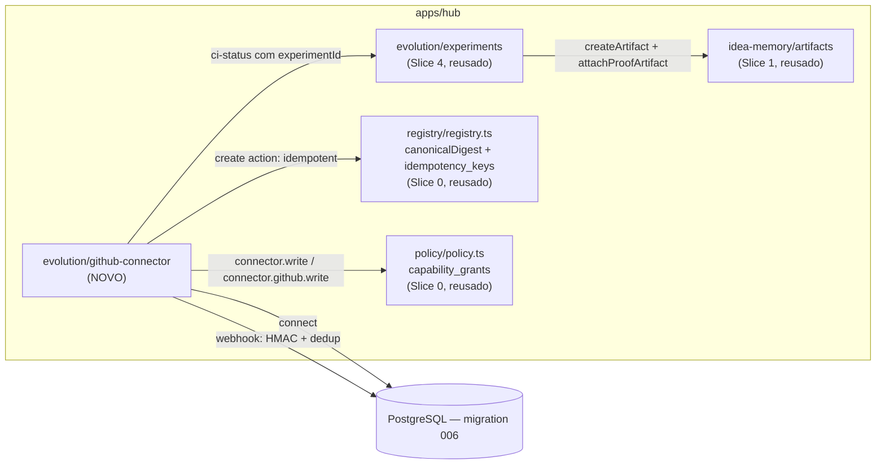

# Slice 5 — Reversible External Action Design

**Spec**: `.specs/features/slice-5-reversible-external-action/spec.md`
**Status**: Approved

## Constraints carregadas

`.specs/STATE.md` Decisions AD-001..006 — todas ativas, nenhuma conflita: TS/pnpm monorepo (AD-004), Postgres real (AD-005), `tlc-spec-driven` (AD-001), slices verticais como unidade de entrega (AD-002), docs-graph íntegro (AD-003), workflow durável mínimo não usado aqui (AD-006, ações são síncronas como o Challenger/experimento).

## Abordagem

Novo módulo `apps/hub/src/evolution/github-connector.ts` seguindo o padrão `insertX`/`listX`/`withTx` dos Slices 1-4. A criação de ação externa reusa o mecanismo genérico de idempotência já provado no Slice 0 (`idempotency_keys`, `canonicalDigest` de `apps/hub/src/registry/registry.ts`) em vez de inventar um segundo esquema de idempotência.

**Alternativa considerada e rejeitada**: um schema de idempotência próprio para `github_actions` (coluna `idempotency_key` + `request_digest` na própria tabela). Rejeitada porque `idempotency_keys` já resolve exatamente esse problema (chave `(org_id, key)`, digest canônico, resposta armazenada) — duplicar o padrão contradiria "Reuse is king" sem ganho algum.

**Achado durante a pesquisa de reuso (flag de tech debt, não corrigido neste slice)**: `apps/hub/src/registry/registry.ts:13-27` define seu PRÓPRIO `canonicalJson`/`canonicalDigest`, independente do `apps/hub/src/platform/canonical-json.ts` extraído no Slice 4 T2 a partir do Cartographer. As duas implementações são quase idênticas, exceto que a de `registry.ts` filtra chaves com valor `undefined` antes de serializar (`.filter(([, v]) => v !== undefined)`), enquanto a de `platform/canonical-json.ts` não filtra. Consolidar as duas mudaria o digest de manifests com campos `undefined` já usados pela idempotência do Slice 0 (`registerProject`) — risco real e desnecessário para este slice. **Mitigação**: este slice reusa `canonicalDigest`/`idempotency_keys` de `registry.ts` tal como estão (import direto, zero mudança de comportamento); a consolidação das duas implementações fica registrada aqui como dívida técnica para uma limpeza futura dedicada, com teste de regressão explícito para o caso `undefined`.

## Architecture Overview



Fluxo do vertical slice deste slice: conectar repo (declarado) → webhook validado e deduplicado (assinatura HMAC-SHA256 sobre o JSON canônico do corpo) → criar ação externa controlada (`issue`/`branch`/`draftPr`, adapter determinístico, idempotente via o mecanismo do Slice 0) → registrar status de CI → se a ação referencia um experimento, criar+anexar automaticamente um proof artifact (Slice 4, inalterado).

## Code Reuse Analysis

| Componente | Location | How to Use |
| --- | --- | --- |
| `withTx`, `requireOwnedProject`, `enforceCapability` | Slices 0-4 | Reusados sem alteração em todas as novas rotas |
| `canonicalDigest`, tabela `idempotency_keys` | `apps/hub/src/registry/registry.ts` (Slice 0) | Reusados tal como estão para a criação de ação (GH-09/10) — mesmo padrão de `registerProject` |
| `createArtifact` | `apps/hub/src/idea-memory/artifacts.ts` (Slice 1) | Reusado sem alteração — status de CI vinculado a um experimento cria um artifact `type='ci_status'` |
| `attachProofArtifact` | `apps/hub/src/evolution/experiments.ts` (Slice 4) | Reusado sem alteração — liga o artifact criado ao experimento |
| Padrão `insertX`/`listX` com `withTx` | Slices 1-4 | Aplicado a `github_connections`/`github_webhook_events`/`github_actions` |
| Padrão de adapter determinístico plugável | `apps/hub/src/evolution/analysis-provider.ts` (Slice 3) | Modelo direto para `GitHubActionConnector` — uma interface, um adapter mock |

### Integration Points

| System | Integration Method |
| --- | --- |
| PostgreSQL | Migration `006_github_connectors.sql` |

## Components

### apps/hub — evolution/github-connector

- **Purpose**: Conectar um repo GitHub (metadado declarado); ingerir webhooks com assinatura e dedup; criar ações externas controladas via adapter determinístico e idempotente; registrar status de CI, criando proof artifact automático quando a ação referencia um experimento.
- **Location**: `apps/hub/src/evolution/github-connector.ts`
- **Interfaces**: `POST /projects/:id/connectors/github`; `POST /projects/:id/connectors/github/:connectionId/webhook`; `POST /projects/:id/connectors/github/actions`; `POST /projects/:id/connectors/github/actions/:actionId/ci-status`.
- **Dependencies**: `registry/registry.ts` (`canonicalDigest`, `idempotency_keys`), `idea-memory/artifacts.ts`, `evolution/experiments.ts`.

## Data Models (SQL — `apps/hub/migrations/006_github_connectors.sql`)

```sql
github_connections(id text PK, project_id, org_id, workspace_id,
                    owner text not null, repo text not null,
                    webhook_secret text not null,
                    status text not null default 'connected',
                    last_event_at timestamptz,
                    created_at timestamptz not null default now(),
                    UNIQUE(project_id, owner, repo))
github_webhook_events(id text PK, connection_id text references github_connections(id),
                       delivery_id text not null, payload jsonb not null,
                       received_at timestamptz not null default now(),
                       UNIQUE(connection_id, delivery_id))
github_actions(id text PK, project_id, org_id, workspace_id,
               connection_id text references github_connections(id),
               action_type text not null,          -- issue | branch | draftPr
               proposal_id text references proposals(id),   -- nullable
               experiment_id text references experiments(id), -- nullable
               title text not null,
               external_ref text not null,          -- mock reference from the adapter
               created_at timestamptz not null default now())
github_action_ci_statuses(id text PK, action_id text references github_actions(id),
                           context text not null, state text not null, target_url text,
                           created_at timestamptz not null default now())
```

**Relationships**: `github_actions` NÃO tem coluna própria de idempotência — a tupla `(org_id, Idempotency-Key)` vive em `idempotency_keys` (Slice 0), com `response` guardando `{actionId, externalRef}`; a criação da ação e o insert em `idempotency_keys` acontecem na MESMA transação (`withTx`), mesmo padrão de `registerProject`. `github_action_ci_statuses` é append-only, N:1 com `github_actions` (uma ação pode ter vários status ao longo do tempo, ex. `pending` → `success`). Quando `github_actions.experiment_id` não é nulo, um status de CI cria um `artifacts` row (`type='ci_status'`) e o liga via `experiment_artifacts` (Slice 4), sem nenhuma coluna nova nessas tabelas.

## Error Handling Strategy

| Error Scenario | Handling | User Impact |
| --- | --- | --- |
| Conectar sem owner/repo | 422 `invalid_connection` | — |
| Conectar owner/repo já conectado no projeto | 409 `already_connected` | — |
| Webhook com assinatura inválida | 401 `invalid_signature` | evento não gravado |
| Webhook com delivery ID repetido | 200 no-op (não é erro) | — |
| `actionType` inválido | 422 `invalid_action_type` | — |
| Criar ação sem `Idempotency-Key` | 422 `missing_idempotency_key` | — |
| Replay de `Idempotency-Key` com digest diferente | 409 `idempotency_conflict` | — |
| Falta a capability `connector.github.write` | 403 `capability_denied` | — |
| Status de CI para ação inexistente | 404 `not_found` | — |

## Risks & Concerns

| Concern | Location | Impact | Mitigation |
| --- | --- | --- | --- |
| Duas implementações independentes de `canonicalJson`/digest (`registry.ts` vs `platform/canonical-json.ts`) — tech debt encontrada durante a pesquisa de reuso deste slice | `apps/hub/src/registry/registry.ts:13-27` | Manutenção duplicada; risco de as duas divergirem silenciosamente no futuro | Não consolidar agora (mudaria o digest de idempotência do Slice 0 para manifests com campos `undefined` — risco desnecessário); registrado aqui para uma limpeza futura dedicada e testada |
| Assinatura HMAC calculada sobre o JSON canônico do corpo já parseado, não sobre os bytes brutos da requisição | `apps/hub/src/evolution/github-connector.ts` (webhook) | Não replica bit-a-bit como o GitHub real assina webhooks (que usa os bytes crus) | Capturar o corpo bruto exigiria mudar o content-type parser do Fastify globalmente, fora do escopo deste vertical slice; documentado como Assumption — a mecânica HMAC é real e testável, só o formato exato do payload de origem é que é sintético (ver Out of Scope: sem chamadas reais ao GitHub) |
| Webhook secret armazenado em texto puro na tabela `github_connections` | `apps/hub/migrations/006_github_connectors.sql` | Um dump do banco expõe o secret | Aceito para o MVP — `integration-contracts.md` §3 prioriza vault, mas isso é infra de plataforma fora de um vertical slice; nenhuma credencial de terceiros real trafega aqui (o secret é gerado localmente, não é um token do GitHub) |

## Tech Decisions (only non-obvious ones)

| Decision | Choice | Rationale |
| --- | --- | --- |
| Idempotência de criação de ação reusa `idempotency_keys` do Slice 0 | Sem coluna própria em `github_actions` | Ver Abordagem — o mesmo problema já tem solução provada |
| Status de CI é um endpoint autenticado (capability), não um segundo webhook | `POST .../actions/:actionId/ci-status` exige `connector.github.write` | Evita duas trilhas de verificação de assinatura no mesmo slice; realista para o MVP (um CI real reportaria via webhook numa extensão futura, usando a MESMA validação de assinatura já construída aqui) |
| Proof artifact automático via `type='ci_status'` | Reusa `createArtifact` sem estender seu schema | Nenhum campo novo necessário — `content` do artifact carrega o status serializado |
| Vínculo ação↔experimento é opcional (`experiment_id` nullable) | Ação pode existir sem proof automático | Nem toda ação externa nasce de um experimento (ex. uma issue de descoberta antes de qualquer experimento existir) |

Nenhuma decisão aqui atinge o critério de projeto-level (a reutilização de `idempotency_keys` é aplicação do padrão já estabelecido, não uma convenção nova).

---

## Review do slice (checklist de `docs/06-delivery/05-build-sequence.md`)

| Pergunta | Resposta |
| --- | --- |
| Usuário entende o valor? | Sim — uma proposal (ou investigação livre) agora pode virar trabalho real rastreável: conectar o repo → criar uma issue/branch/draft PR controlada (nunca merge/deploy) → o status de CI dessa ação vira prova automática no experimento vinculado, sem passo manual — "proposta vira trabalho real com controle" (build-sequence, Slice 5) |
| O novo artifact está no knowledge model? | Sim — o `external_ref` do adapter determinístico é o primeiro "fato declarado sobre o mundo externo" deste slice (uma issue/branch/PR *representada*, não executada de fato); o proof artifact `type='ci_status'` estende o mesmo conceito de prova do Slice 4 sem inventar um novo, só uma nova fonte automática para ele |
| Evidence/decision lineage existe? | Sim, estendido: `proposal`/`experiment` (Slice 3/4) → `github_action` (referencia opcionalmente `proposal_id`/`experiment_id`) → `github_action_ci_status` → `artifact` (`type='ci_status'`) → `experiment_artifacts` (Slice 4, inalterado). A ação externa em si vira um elo auditável entre a decisão e a prova coletada fora do sistema |
| Policy e classification cobrem o fluxo? | Sim — `connector.write`/`connector.github.write` seguem o mesmo deny-by-default dos Slices 0-4, testados para os dois tenants dev na mesma edição. O webhook é a única rota do produto até agora sem `requireScope` — documentado explicitamente como decisão de design (mesmo espírito do node auth do Slice 2: a credencial é a assinatura HMAC, não uma sessão de usuário) |
| Failure/retry/idempotency definidos? | Sim — criação de ação reusa o mecanismo de idempotência do Slice 0 (`idempotency_keys` + `canonicalDigest`, mesma transação com `for update`) em vez de inventar um segundo esquema; dedup de webhook via `ON CONFLICT DO NOTHING` (mesmo padrão do Slice 3); o anexo automático de proof artifact é best-effort — falha (experimento não mais `running`) nunca impede o registro do status de CI em si |
| Evals incluem negative cases? | Sim: conectar sem owner/repo, conectar duplicado, assinatura de webhook inválida, `actionType` fora de `{issue, branch, draftPr}` (prova que merge/deploy é impossível), replay de idempotency key com payload igual e com payload diferente, `connectionId` desconhecido/de outro projeto, status de CI para ação inexistente, ação sem `experimentId`, experimento não mais `running` no momento do CI, cross-tenant em toda rota nova |
| O profile Lite continua possível? | Sim — nenhuma infraestrutura nova além do mesmo Postgres; o `GitHubActionConnector` é 100% determinístico e local, sem chamada de rede real ao GitHub, preservando o profile Lite sem custo de infraestrutura adicional |
| Alguma hipótese do ecossistema foi invalidada? | Não invalidou nenhum ADR. A pesquisa de reuso deste slice encontrou uma dívida técnica real não corrigida (duas implementações independentes de `canonicalJson`/digest, `registry.ts` vs `platform/canonical-json.ts` do Slice 4) — documentada em Risks & Concerns com uma mitigação explícita (não consolidar agora, risco desnecessário à idempotência do Slice 0) em vez de ser silenciosamente ignorada ou corrigida às pressas fora de escopo |
