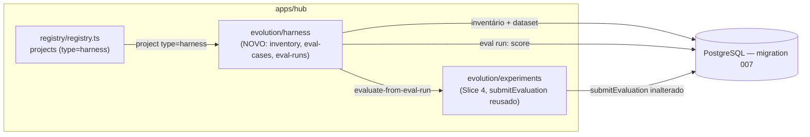

# Slice 6 — Harness Vertical Design

**Spec**: `.specs/features/slice-6-harness-vertical/spec.md`
**Status**: Approved

## Constraints carregadas

`.specs/STATE.md` Decisions AD-001..006 — todas ativas, nenhuma conflita: TS/pnpm monorepo (AD-004), Postgres real (AD-005), `tlc-spec-driven` (AD-001), slices verticais como unidade de entrega (AD-002), docs-graph íntegro (AD-003), workflow durável mínimo não usado aqui (AD-006).

## Abordagem

Novo módulo `apps/hub/src/evolution/harness.ts` seguindo o padrão `insertX`/`listX`/`withTx` dos Slices 1-5. A decisão real de design é NÃO criar um segundo mecanismo de experimento/promoção — o endpoint de avaliação-por-eval-run deste slice é uma fina camada sobre `submitEvaluation` (Slice 4, `apps/hub/src/evolution/experiments.ts`), reusado sem nenhuma alteração de assinatura ou comportamento.

**Alternativa considerada e rejeitada**: um subsistema de "harness experiment" próprio, com suas próprias tabelas de status/veredito. Rejeitada porque `observability-evals.md` §9 já descreve UM gate genérico ("mudança de model, prompt, skill, policy ou module") que o Slice 4 já implementa; duplicar seria contradizer a própria doc-fonte e criar dois lugares para a mesma decisão de promover/reverter.

## Architecture Overview



Fluxo do vertical slice deste slice: projeto `harness` (Slice 0, sem mudança) → declarar inventário versionado → declarar dataset de eval → rodar eval determinístico (score) → alimentar a avaliação de um experimento do Slice 4 já em andamento (mesmo gate genérico de promoção) → Observatory agrega tudo.

## Code Reuse Analysis

| Componente | Location | How to Use |
| --- | --- | --- |
| `withTx`, `requireOwnedProject`, `enforceCapability` | Slices 0-5 | Reusados sem alteração em todas as novas rotas |
| `submitEvaluation` | `apps/hub/src/evolution/experiments.ts` (Slice 4) | Reusado sem alteração — o endpoint de avaliação-por-eval-run só computa o score e chama esta função |
| `registerProject` | `apps/hub/src/registry/registry.ts` (Slice 0) | Reusado sem alteração — um harness é criado pelo endpoint de projeto já existente, com `metadata.type='harness'` |
| Padrão `insertX`/`listX` com `withTx` | Slices 1-5 | Aplicado a `harness_inventories`/`harness_eval_cases`/`harness_eval_runs` |
| Padrão de versionamento incremental | `apps/hub/src/idea-memory/artifacts.ts` (`addArtifactVersion`, Slice 1) | Modelo direto para `harness_inventories.version` |
| Padrão de função pura determinística | `apps/hub/src/evolution/analysis-provider.ts` (Slice 3), `evaluateExperiment` (Slice 4) | Modelo direto para `runEvalCase(inventory, evalCase) => {passed, reason}` |

### Integration Points

| System | Integration Method |
| --- | --- |
| PostgreSQL | Migration `007_harness.sql` |

## Components

### apps/hub — evolution/harness

- **Purpose**: Declarar/ler inventário versionado; declarar/listar dataset de eval; rodar o eval determinístico contra o inventário atual; avaliar um experimento do Slice 4 a partir de um eval run; agregar tudo na Observatory.
- **Location**: `apps/hub/src/evolution/harness.ts`
- **Interfaces**: `POST /projects/:id/harness/inventory`; `GET /projects/:id/harness/inventory`; `POST /projects/:id/harness/eval-cases`; `GET /projects/:id/harness/eval-cases`; `POST /projects/:id/harness/eval-runs`; `POST /projects/:id/harness/experiments/:experimentId/evaluate-from-eval-run`; `GET /projects/:id/harness/observatory`.
- **Dependencies**: `evolution/experiments` (`submitEvaluation`).

## Data Models (SQL — `apps/hub/migrations/007_harness.sql`)

```sql
harness_inventories(id text PK, project_id, org_id, workspace_id,
                     version int not null,
                     skills jsonb not null default '[]'::jsonb,
                     mcps jsonb not null default '[]'::jsonb,
                     models jsonb not null default '[]'::jsonb,
                     created_at timestamptz not null default now(),
                     UNIQUE(project_id, version))
harness_eval_cases(id text PK, project_id, org_id, workspace_id,
                    name text not null,
                    invariant_type text not null,
                    params jsonb not null,
                    created_at timestamptz not null default now())
harness_eval_runs(id text PK, project_id, org_id, workspace_id,
                   inventory_version int not null,
                   score_passed int not null,
                   score_total int not null,
                   results jsonb not null,
                   created_at timestamptz not null default now())
```

**Relationships**: `harness_inventories` é append-only, uma linha por versão (mesmo padrão de `artifact_versions`). `harness_eval_runs.inventory_version` referencia a versão usada naquele run (não uma FK formal — mesmo espírito de `candidates.snapshot_id` do Slice 2, um vínculo de auditoria sem exigir a linha ainda existir se um inventário for reescrito). `harness_eval_runs.results` é um array `[{caseId, name, invariantType, passed, reason}]`.

## Error Handling Strategy

| Error Scenario | Handling | User Impact |
| --- | --- | --- |
| Declarar inventário para projeto inexistente | 404 `not_found` | — |
| Declarar eval case com `invariantType` desconhecido ou `params` incompletos | 422 `invalid_eval_case` | — |
| Rodar eval sem inventário declarado | 422 `harness_requires_inventory` | — |
| Rodar eval sem eval cases declarados | 422 `harness_requires_eval_cases` | — |
| Ler inventário sem nenhum declarado ainda | 404 `not_found` | — |
| Avaliar experimento de outro projeto via eval run | 404 `not_found` (mesma semântica do path param `:experimentId`, convenção do Slice 3/4) | — |
| Avaliar experimento não `running` via eval run | 409 `invalid_transition` (propagado de `submitEvaluation`) | — |

## Risks & Concerns

| Concern | Location | Impact | Mitigation |
| --- | --- | --- | --- |
| Os 4 tipos de invariante são checks estruturais sobre o inventário DECLARADO, não uma auditoria real de skills/MCPs em uso | `apps/hub/src/evolution/harness.ts` | Um harness pode "passar" no eval mesmo com skills declaradas mas quebradas na prática | Documentado explicitamente em Out of Scope da spec; mesma limitação já aceita para o `AnalysisProvider` do Slice 3 — determinístico é sobre o que está declarado, não sobre execução real |
| `harness_eval_runs.inventory_version` não é uma FK formal | `apps/hub/migrations/007_harness.sql` | Um run pode referenciar uma versão de inventário que nunca existiu se o cliente enviar um valor arbitrário | Não aplicável neste slice — `inventory_version` é sempre lido do banco (versão atual no momento do run), nunca aceito como input do cliente; nenhuma rota escreve esse campo a partir de payload externo |
| Reuso de `submitEvaluation` sem estender seu tipo de retorno para incluir contexto de harness | `apps/hub/src/evolution/experiments.ts` | A resposta do endpoint de avaliação-por-eval-run precisa remontar o "shape" da resposta original do Slice 4 manualmente | Aceito — a rota nova só espelha o formato de resposta já usado em `POST .../experiments/:id/evaluate`; nenhuma mudança na função reusada |

## Tech Decisions (only non-obvious ones)

| Decision | Choice | Rationale |
| --- | --- | --- |
| Endpoint de avaliação-por-eval-run em vez de reescrever `submitEvaluation` para aceitar um "score provider" plugável | Nova função `evaluateExperimentFromEvalRun` que computa o score e chama `submitEvaluation(pool, projectId, experimentId, score)` diretamente | Interface plugável dentro de `submitEvaluation` seria over-engineering para um único caller; a composição por chamada direta já é suficientemente desacoplada |
| Score como razão `passed/total` (float 0-1), não contagem bruta | Consistente com `VerificationPlan.threshold` do Slice 4, que já é `number` livre — o cliente que inicia o experimento escolhe o threshold no formato que quiser (ex. `0.8`) | Nenhuma mudança de schema no Slice 4 necessária |
| `min_component_count` valida `category` contra um enum fechado na declaração do eval case, não na execução | Validação em `apps/hub/src/registry/routes.ts` (rota de criação do eval case), mesmo padrão de `isValidVerificationPlan` do Slice 4 | Falha cedo — um eval case malformado nunca chega a ser persistido para falhar silenciosamente só na hora de rodar |

Nenhuma decisão aqui atinge o critério de projeto-level (reuso de `submitEvaluation` é aplicação do princípio "Reuse is king" já em vigor, não uma convenção nova).

---

## Review do slice (checklist de `docs/06-delivery/05-build-sequence.md`)

| Pergunta | Resposta |
| --- | --- |
| Usuário entende o valor? | Sim — o harness (modelos, skills, MCPs que o próprio EvolutionOS usa) agora tem um inventário versionado e um dataset de eval determinístico, e o score desse eval alimenta o mesmo gate de promoção que qualquer outra proposta usa — "o EvolutionOS aplica a si mesmo a mesma disciplina que aplica a qualquer outro sistema que evolui" (build-sequence, Slice 6) |
| O novo artifact está no knowledge model? | Sim — `harness_inventories` e `harness_eval_cases` são a primeira representação declarada do próprio harness agentic no Project Twin (`metadata.type='harness'`, já previsto por `CORE-FR-001`); `harness_eval_runs` estende o mesmo conceito de prova determinística já usado pelo `AnalysisProvider` do Slice 3, sem inventar um novo tipo de artifact |
| Evidence/decision lineage existe? | Sim, fechado ponta a ponta: inventário declarado → eval cases declarados → eval run (score determinístico) → `evaluateExperimentFromEvalRun` chama `submitEvaluation` (Slice 4) inalterado → experimento vai a `evaluated` com veredito → decisão preservada pelo mesmo mecanismo dos Slices 1/3. Nenhum elo novo de persistência de decisão foi criado — o slice só alimenta o elo já existente com uma nova fonte de score |
| Policy e classification cobrem o fluxo? | Sim — `harness.write` (inventário, eval cases, eval runs) segue o mesmo deny-by-default dos Slices 0-5, concedido aos dois tenants dev na mesma edição (T1). O endpoint de avaliação-por-eval-run reusa `experiment.write` do Slice 4 em vez de `harness.write`, por ser uma operação sobre um experimento já existente — decisão confirmada nas Assumptions da spec e corrigida durante o fechamento do slice (a implementação inicial de T5 usava `harness.write` por engano) |
| Failure/retry/idempotency definidos? | Sim — inventário é append-only por versão incremental (mesmo padrão de `artifact_versions`, Slice 1), sem necessidade de idempotency key (cada declaração é uma nova versão válida por design, nunca um replay); eval run com score `0/total` persiste normalmente, nunca como erro; `evaluateExperimentFromEvalRun` propaga os mesmos guards de `submitEvaluation` (404 cross-project, 409 não-`running`) sem reimplementá-los |
| Evals incluem negative cases? | Sim: declarar/rodar eval para projeto inexistente (404), `invariantType` desconhecido ou `params` incompletos para o tipo declarado (422, os 4 tipos cobertos), rodar sem inventário declarado (422), rodar sem eval cases declarados (422), avaliar experimento de outro projeto via eval run (404), avaliar experimento não-`running` via eval run (409), Observatory para projeto inexistente (404), cross-tenant em toda rota nova (403) |
| O profile Lite continua possível? | Sim — nenhuma infraestrutura nova além do mesmo Postgres; os 4 tipos de invariante são checks estruturais puros sobre o inventário declarado, sem chamada de rede ou execução real de skill/MCP/modelo, preservando o profile Lite sem custo de infraestrutura adicional |
| Alguma hipótese do ecossistema foi invalidada? | Não invalidou nenhum ADR. O fechamento do slice encontrou um desvio real entre a implementação de T5 e a Assumption confirmada da spec (capability `harness.write` em vez de `experiment.write` no endpoint de avaliação-por-eval-run) — corrigido antes de fechar o slice em vez de silenciosamente ignorado ou deixado para o Verifier encontrar |
