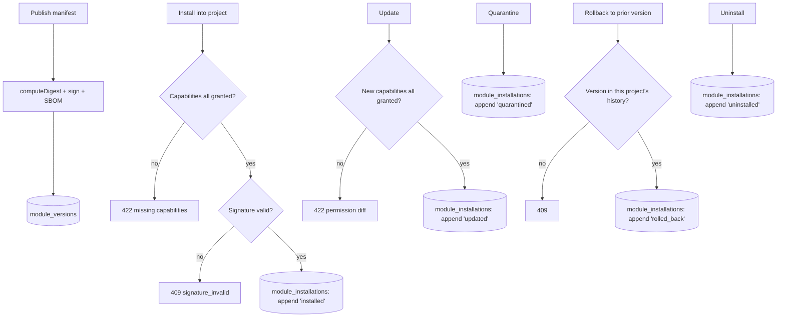

# Slice 7 — Module Lifecycle Design

**Spec**: `.specs/features/slice-7-module-lifecycle/spec.md`
**Status**: Approved

---

## Constraints carregadas

`.specs/STATE.md` Decisions (AD-001..006), todas `active`, nenhuma em conflito — este design as segue sem superseder nenhuma:

- AD-001 (skill spec-driven única) — seguido: este design nasce de `spec.md` validado.
- AD-004 (monorepo TS/pnpm, contratos só em `packages/contracts`) — este slice não precisa de tipos compartilhados com `apps/node`/`apps/console` (módulo é gerenciado só pelo Hub neste MVP), então nenhum novo tipo entra em `packages/contracts`.
- AD-005 (Postgres real via `scripts/dev-db.sh`) — seguido: `module_installations`/`modules`/`module_versions`/`module_publisher_keys` são tabelas Postgres reais, testadas por integração.

Nenhuma lição confirmada existe ainda (`lessons.py list --status confirmed` retornou vazio) — todos os slices anteriores fecharam com Verifier PASS limpo, sem gap distillado.

## Abordagem

Uma única abordagem é viável dado o escopo confirmado na spec (Out of Scope já exclui OCI/Sigstore reais, execução real de componente e resolução de compatibilidade contra runtime real): o Hub é o registry privado (Postgres), a assinatura usa um par Ed25519 gerado por org, e o motor de policy já existente (`capability_grants`/`checkCapability`, Slice 0) é reusado sem duplicação para o gate de instalação/atualização. Não há uma segunda abordagem razoável a comparar aqui — as alternativas (ex. assinar com HMAC compartilhado, ou inventar um segundo motor de aprovação de capability) foram descartadas na fase Specify e registradas como Assumptions, não como uma escolha de design em aberto.

## Architecture Overview

Fluxo do vertical slice: publisher declara um manifest → Hub computa digest canônico, assina com a chave Ed25519 do org (gerada na primeira publicação), gera SBOM determinístico → versão fica no registry privado (Postgres, escopado por org) → um projeto instala uma versão publicada (policy check: toda capability declarada precisa já ter grant no org; assinatura é reverificada) → lockfile append-only por projeto registra cada mudança de estado (install/update/quarantine/rollback/uninstall) → leitura do lockfile deriva o estado "atual" da última linha por `(project_id, module_id)`, mesmo padrão já usado pelo inventário do Harness (Slice 6).



---

## Code Reuse Analysis

| Componente | Location | How to Use |
| --- | --- | --- |
| `canonicalJson` | `apps/hub/src/platform/canonical-json.ts` (Slice 4) | Reusado sem alteração para computar o digest canônico do manifest — mesma linhagem já usada por `computeProposalDigest` (Slice 4) e distinta de `registry.ts`'s própria `canonicalJson` (dívida técnica já documentada no Slice 5, não tocada aqui) |
| `withTx`, `requireOwnedProject`, `enforceCapability`, `requireScope` | Slices 0-6 | Reusados sem alteração em toda rota nova |
| `checkCapability`/`capability_grants` (deny-by-default) | `apps/hub/src/policy/policy.ts` (Slice 0) | Reusado SEM alteração e SEM um segundo motor: cada capability declarada por um módulo é checada como uma capability comum contra `capability_grants` do org — mesmo mecanismo que já protege toda rota de escrita desde o Slice 0 |
| Padrão "append-only, estado atual = última linha por chave" | `harness_inventories` (Slice 6), `artifact_versions` (Slice 1) | Modelo direto para `module_installations`: cada ação (install/update/quarantine/rollback/uninstall) é uma nova linha com `seq` incremental por `(project_id, module_id)`; o estado atual é derivado, nunca um `UPDATE` in-place |
| Padrão de idempotência por chave natural (sem `Idempotency-Key` de cliente) | `harness_inventories.version` (Slice 6) | Aplicado a `module_versions`: `(module_id, version)` é a chave natural de idempotência — publicar de novo com o mesmo digest é replay, com digest diferente é 409 |
| `createHash("sha256")` | `registry.ts::canonicalDigest` (padrão, não a função) | Mesmo formato `sha256:<hex>` replicado localmente em `modules.ts` sobre o `canonicalJson` do Slice 4 (não importa `registry.ts`, que usa uma `canonicalJson` diferente — ver linha acima) |

### Integration Points

| System | Integration Method |
| --- | --- |
| PostgreSQL | Migration `008_modules.sql` |
| `node:crypto` | `generateKeyPairSync("ed25519")`, `sign(null, digestBytes, privateKey)`, `verify(null, digestBytes, publicKey, signature)` — criptografia real, autoridade de identidade local (ver spec Out of Scope) |

---

## Components

### apps/hub — evolution/modules

- **Purpose**: Publicar/ler versões de módulo assinadas com SBOM; instalar/atualizar com policy check e diff de permissão; quarentena/rollback/desinstalação sobre um lockfile append-only por projeto; listar o registry privado do org.
- **Location**: `apps/hub/src/evolution/modules.ts`
- **Interfaces**: `POST /orgs/current/modules` (publish); `GET /orgs/current/modules` (list); `GET /orgs/current/modules/:moduleId/versions/:version` (read + signatureValid); `POST /projects/:id/modules/:moduleId/install`; `POST /projects/:id/modules/:moduleId/update`; `POST /projects/:id/modules/:moduleId/quarantine`; `POST /projects/:id/modules/:moduleId/rollback`; `POST /projects/:id/modules/:moduleId/uninstall`; `GET /projects/:id/modules/lockfile`.
- **Dependencies**: `platform/canonical-json` (`canonicalJson`), `policy/policy` (`checkCapability`/`enforceCapability`), `node:crypto`.
- **Reuses**: `withTx`, `requireOwnedProject`, `requireScope`, o padrão append-only+estado-derivado do Slice 6.

**Nota sobre escopo de rota**: publish/list/read de módulo são operações de ORG (registry privado), não de projeto — não passam por `requireOwnedProject` (que é projeto-scoped); usam `requireScope` + `enforceCapability(scope, "module.write", ...)` diretamente, checando `scope.orgId` apenas. Install/update/quarantine/rollback/uninstall/lockfile SÃO projeto-scoped e passam por `requireOwnedProject` (404-antes-403 já estabelecido).

---

## Data Models (SQL — `apps/hub/migrations/008_modules.sql`)

```sql
modules(id text PK,                      -- manifest.id (reverse-DNS), reivindicado pelo primeiro publish
        org_id text not null,            -- org dono; um 2º org publicando o mesmo id é rejeitado
        name text not null,
        created_at timestamptz not null default now())

module_publisher_keys(org_id text PK,
                       public_key text not null,   -- Ed25519, base64 (spki der)
                       private_key text not null,  -- Ed25519, base64 (pkcs8 der) — ver Risks & Concerns
                       created_at timestamptz not null default now())

module_versions(id text PK,
                 module_id text not null references modules(id),
                 org_id text not null,
                 version text not null,             -- SemVer string
                 manifest jsonb not null,
                 digest text not null,               -- "sha256:<hex>" de canonicalJson(manifest)
                 signature text not null,             -- base64, Ed25519 sobre os bytes do digest
                 sbom jsonb not null,
                 provenance jsonb not null,
                 created_at timestamptz not null default now(),
                 UNIQUE(module_id, version))

module_installations(id text PK,
                      project_id text not null references projects(id),
                      org_id text not null,
                      workspace_id text not null,
                      module_id text not null references modules(id),
                      seq int not null,               -- 1,2,3... por (project_id, module_id), append-only
                      version text not null,
                      digest text not null,
                      capabilities jsonb not null,    -- snapshot das capabilities desta versão no momento da ação
                      status text not null,           -- active | quarantined | uninstalled
                      action text not null,           -- installed | updated | quarantined | rolled_back | uninstalled
                      created_at timestamptz not null default now(),
                      UNIQUE(project_id, module_id, seq))
```

**Relationships**: `module_versions.module_id` referencia `modules.id` (append-only por módulo, uma linha por versão — mesmo padrão de `harness_inventories`). `module_installations` é append-only por `(project_id, module_id)`: nunca um `UPDATE`; o estado "atual" é a linha de maior `seq` para essa chave. O lockfile de um projeto (`MODL-11`) é a projeção "última linha por `(project_id, module_id)` com `status = 'active'`" sobre essa tabela. Nenhuma linha de `module_installations` ou `module_versions` é deletada por nenhuma operação deste slice — quarantine/rollback/uninstall são sempre `INSERT`, nunca `DELETE`/`UPDATE` (MOD-FR-012, PRD-005 critério "desinstalar não apaga evidências").

---

## Error Handling Strategy

| Error Scenario | Handling | User Impact |
| --- | --- | --- |
| Publicar manifest malformado (id/version/publisher ausente, 0 components, tipo de component inválido, `version` não-SemVer, IDs de component duplicados) | 422 `invalid_manifest` | Corpo lista o motivo específico |
| Publicar mesma `(module_id, version)` com digest diferente do já publicado | 409 `version_conflict` | Cliente deve publicar uma nova versão, versões são imutáveis |
| Publicar mesma `(module_id, version)` com o MESMO digest | 200/201 idempotente, retorna a versão existente | Replay transparente, nenhuma segunda linha |
| Instalar/atualizar com capability do módulo sem grant no org | 422 `module_requires_capability_grant`, lista `missing: string[]` | Operador sabe exatamente o que conceder antes de tentar de novo |
| Instalar/atualizar com assinatura que não reverifica contra o digest recomputado | 409 `signature_invalid` | Instalação bloqueada, nada persistido |
| Instalar módulo/versão desconhecidos | 404 `not_found` | — |
| Atualizar/rollback uma instalação `quarantined` ou `uninstalled` | 409 `invalid_transition` | — |
| Rollback para uma versão nunca instalada por aquele projeto | 409 `unproven_version` | Rollback nunca instala uma versão nova por essa porta lateral |
| Qualquer rota deste slice cross-tenant | 403 `access_denied` (project-scoped) ou `capability_denied` (org-scoped) | Consistente com toda rota desde o Slice 0 |

---

## Risks & Concerns

| Concern | Location | Impact | Mitigation |
| --- | --- | --- | --- |
| Custódia de chave privada Ed25519 em texto simples no Postgres (`module_publisher_keys.private_key`) | `apps/hub/migrations/008_modules.sql` | Um vazamento de DB compromete a capacidade de assinar como aquele org | Documentado explicitamente como simplificação de MVP/spike (mesmo nível de maturidade do webhook secret em texto simples do Slice 5); produção exigiria KMS/HSM ou o fluxo keyless do Sigstore — é exatamente o gap que o review trigger do ADR-008 aponta |
| Capability do módulo é comparada literalmente contra `capability_grants.capability`, sem suportar wildcard/qualifier (`network.read:declared-domains` precisa de um grant EXATO com essa string) | `apps/hub/src/evolution/modules.ts` (policy check) | Um operador precisa conceder a string exata que cada módulo declara, não uma família de capabilities | Aceito como decisão de MVP (documentado nas Assumptions da spec); o motor de `capability_grants` já suporta strings arbitrárias, então nenhuma migração de policy é necessária se um parsing de wildcard for adicionado depois |
| `modules.id` reivindicado por ordem de chegada (primeiro publish vence); nenhuma verificação de identidade real do publisher | `apps/hub/src/evolution/modules.ts` (publish) | Um org poderia reivindicar um `id` reverse-DNS que não controla de fato (ex. `io.evolutionos.foundation.x`) | Fora de escopo para o registry privado deste slice (nenhuma distribuição pública ainda); a validação de namespace de publisher é um problema do marketplace público (PRD-005 §7), explicitamente fora de escopo |

> Nenhum outro concern novo encontrado na varredura do Knowledge Verification Chain sobre `apps/hub/src/registry/routes.ts`, `apps/hub/src/policy/policy.ts` e `apps/hub/src/platform/db.ts`.

---

## Tech Decisions (only non-obvious ones)

| Decision | Choice | Rationale |
| --- | --- | --- |
| Assinatura assimétrica (Ed25519) em vez de HMAC compartilhado (como o webhook do Slice 5) | Ed25519 via `node:crypto`, chave por org | Uma "assinatura" que qualquer leitor pode VERIFICAR sem conhecer um segredo é o que o spike do ADR-008 precisa provar (o webhook HMAC do Slice 5 resolve um problema diferente: autenticar UM emissor conhecido, não publicar verificação pública) |
| `module_installations` append-only com `seq` em vez de uma linha mutável + tabela de histórico separada | Uma única tabela append-only, estado atual derivado por `max(seq)` | Mesmo padrão já em produção no Slice 6 (`harness_inventories`); evita duas fontes de verdade (linha "atual" vs tabela de histórico) que precisariam ficar sincronizadas em toda operação |
| Policy check reusa `capability_grants` sem estender seu schema | Cada capability do módulo é uma string comparada literalmente | "Reuse is king": inventar um segundo motor de aprovação (ex. uma tabela `module_capability_approvals`) duplicaria o deny-by-default que já existe desde o Slice 0 |
| Publish/list/read de módulo são rotas org-scoped, não projeto-scoped | `enforceCapability` direto sobre `scope.orgId`, sem `requireOwnedProject` | O registry privado (PRD-005 §2) pertence ao org, não a um projeto específico — instalar é que é projeto-scoped |

Decisão de projeto-level: **nenhuma** — reuso de `capability_grants` e do padrão append-only são aplicações de convenções já estabelecidas (Slices 0 e 6), não uma convenção nova. A escolha de Ed25519 é local a este slice (não hay outro slice assinando conteúdo hoje).

---

## Review do slice (checklist de `docs/06-delivery/05-build-sequence.md`)

| Pergunta | Resposta |
| --- | --- |
| Usuário entende o valor? | Sim — um publisher agora empacota e assina um módulo, o instala num projeto sabendo exatamente quais capabilities está concedendo, e pode reverter uma instalação problemática sem perder o rastro de nada — "aplica ao próprio EvolutionOS a mesma disciplina de proveniência e controle que ele exige de qualquer sistema que evolui" (mesmo espírito do Slice 6, agora sobre extensões de terceiros) |
| O novo artifact está no knowledge model? | Sim — `module_versions` é a primeira representação assinada e verificável de código de terceiros no sistema (digest + assinatura Ed25519 + SBOM determinístico); `module_installations` estende o mesmo padrão de histórico append-only já usado por `harness_inventories`, agora capturando QUAL versão de QUAL módulo estava ativa em QUAL momento de um projeto |
| Evidence/decision lineage existe? | Parcial e documentado como tal: este slice fecha o lifecycle do PACOTE (publish → install → update → quarantine/rollback → uninstall) mas nenhuma decisão do Slice 1/3 referencia uma instalação de módulo ainda — isso é esperado, já que nenhum component é executado de fato (Out of Scope); o lockfile em si já é a lineage mínima exigida por MOD-FR-012 ("registrar versão efetivamente usada"), pronta para um slice futuro que execute components referenciar |
| Policy e classification cobrem o fluxo? | Sim — `module.write` segue o mesmo deny-by-default dos Slices 0-6, concedido aos dois tenants dev na mesma edição (T1); a checagem de capability do MÓDULO reusa `checkCapability`/`capability_grants` sem um segundo motor, tanto no install (todas as capabilities) quanto no update (só as novas) |
| Failure/retry/idempotency definidos? | Sim — publicação usa `(module_id, version)` como chave natural de idempotência (replay se o digest bate, 409 se não); instalação da mesma versão já ativa é idempotente; toda transição de lifecycle (install/update/quarantine/rollback/uninstall) é um `INSERT` numa tabela append-only, nunca um `UPDATE`/`DELETE` — não há estado parcial possível entre uma falha e um retry |
| Evals incluem negative cases? | Sim: manifest malformado (id/version/publisher ausente, 0 components, tipo inválido, versão não-SemVer, IDs duplicados), reconflito de versão com digest diferente, módulo reivindicado por outro org, capability sem grant (install e update, com a lista exata de faltantes), assinatura adulterada (bloqueia install, não só a leitura), módulo/versão desconhecidos, instalar por cima de uma versão ativa diferente, atualizar/rollback de instalação não-ativa ou desinstalada, rollback para versão nunca provada, cross-tenant em toda rota nova |
| O profile Lite continua possível? | Sim — nenhuma infraestrutura nova além do mesmo Postgres; a assinatura Ed25519 roda em processo via `node:crypto`, sem CA externa, sem OCI registry, sem container/WASM runtime real |
| Alguma hipótese do ecossistema foi invalidada? | Não invalidou nenhum ADR — pelo contrário, este slice É o spike que o ADR-008 (Proposed) pede antes de aceitar OCI+Sigstore como mecanismo de distribuição real; a mecânica de assinar/verificar/detectar adulteração está provada localmente, e a decisão sobre registry/CA reais fica para quando esse spike for avaliado formalmente contra o ADR. Nenhum desvio de spec foi encontrado durante o fechamento desta vez (ao contrário do Slice 6, cujo T5 precisou de uma correção de capability antes de fechar) |
