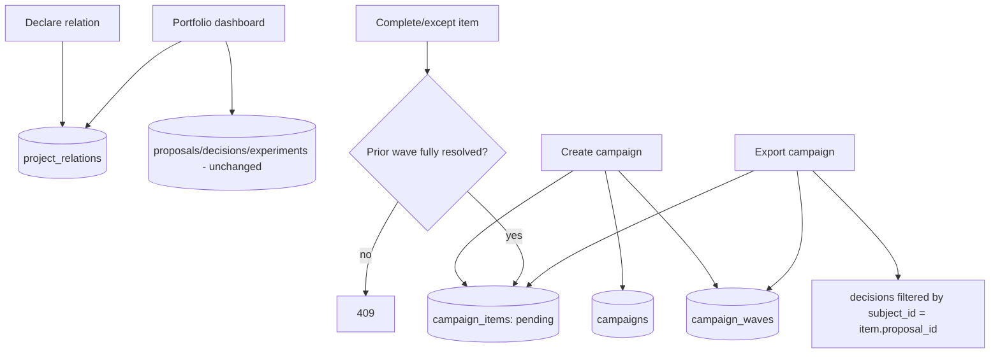

# Slice 8 — Portfolio Campaign Design

**Spec**: `.specs/features/slice-8-portfolio-campaign/spec.md`
**Status**: Approved

---

## Constraints carregadas

`.specs/STATE.md` Decisions (AD-001..006), todas `active`, nenhuma em conflito — este design as segue sem superseder nenhuma. Nenhuma lição confirmada existe ainda (`lessons.py list --status confirmed` retornou vazio) — todos os slices anteriores fecharam com Verifier PASS, alguns após rounds de fix→re-verify, mas nenhum gap virou lição formal ainda.

## Abordagem

Uma única abordagem é viável: o Hub persiste `spec.relations` (já declarado no manifest schema desde o Slice 0, nunca consultado) numa tabela própria, e campaign/waves/items reusam o loop proposal→decisão já existente (Slices 1/3) em vez de duplicá-lo. Não há uma segunda arquitetura razoável a comparar — as alternativas descartadas (detecção automática de finding comum, health score ponderado, agrupamento por label livre) já foram registradas como Out of Scope na fase Specify, não como uma escolha de design em aberto.

## Architecture Overview

Fluxo do vertical slice: um projeto declara uma relação tipada com outro (`project_relations`, novo) → um portfolio consulta suas relações `composition` para montar o dashboard agregado (contagens diretas de `proposals`/`decisions`/`experiments`, Slices 3/4, sem nenhuma tabela nova) → uma campaign nasce de um finding comum com N waves, cada wave com M items `pending` (um por projeto-alvo) → completar/excepcionar um item só é aceito se a wave anterior estiver inteiramente resolvida (gate canary) → o progresso é uma projeção read-only sem nenhum campo de rank → o export agrega waves/items com as decisions do proposal vinculado, via uma nova query filtrada por `subject_id` sobre a MESMA tabela `decisions` do Slice 1 (sem duplicar o mecanismo de registro de decisão).



---

## Code Reuse Analysis

| Componente | Location | How to Use |
| --- | --- | --- |
| `withTx`, `requireOwnedProject`, `enforceCapability`, `requireScope` | Slices 0-7 | Reusados sem alteração em toda rota nova |
| `decisions` table + `subject_type`/`subject_id` columns | `apps/hub/src/idea-memory/decisions.ts` (Slice 1) | Uma nova query pequena (`getProposalDecisions`) filtra por `subject_type='proposal' and subject_id=$1` — não duplica `recordDecision`, só lê com um filtro diferente de `listDecisions` (que filtra por projeto inteiro) |
| `proposals`/`decisions`/`experiments` tables | Slices 3/4 | Reusadas sem alteração para as contagens do dashboard (`status in ('draft','readyForReview')`, `decision='reject'`, `status='running'`) |
| Padrão "capability por domínio, deny-by-default" | `capability_grants`/`checkCapability` (Slice 0) | `portfolio.write` concedida aos dois tenants dev na mesma edição, mesmo padrão de toda capability desde o Slice 0 |
| Padrão append-only + estado atual/histórico | `module_installations` (Slice 7), `harness_inventories` (Slice 6) | `campaign_items` é uma tabela MUTÁVEL, não append-only (ao contrário dos Slices 6/7) — ver Tech Decisions abaixo para o porquê |

### Integration Points

| System | Integration Method |
| --- | --- |
| PostgreSQL | Migration `009_portfolio.sql` |

---

## Components

### apps/hub — evolution/portfolio

- **Purpose**: Declarar/listar relações tipadas entre projetos; agregar o dashboard de um portfolio; criar/gerenciar campaigns organizadas em waves com gate canary; conceder exceções justificadas; expor progresso sem ranking; exportar auditoria.
- **Location**: `apps/hub/src/evolution/portfolio.ts`
- **Interfaces**: `POST /projects/:id/relations`; `GET /projects/:id/relations`; `GET /projects/:id/portfolio/dashboard`; `POST /projects/:id/campaigns` (portfolio-scoped); `GET /projects/:id/campaigns/:campaignId`; `POST /projects/:id/campaigns/:campaignId/items/:itemId/complete`; `POST /projects/:id/campaigns/:campaignId/items/:itemId/exception`; `GET /projects/:id/campaigns/:campaignId/progress`; `GET /projects/:id/campaigns/:campaignId/export`.
- **Dependencies**: `idea-memory/decisions` (nova leitura filtrada, não a gravação).
- **Reuses**: `withTx`, `requireOwnedProject`, `enforceCapability`, `requireScope`.

**Nota sobre escopo de rota**: toda rota de campaign é aninhada sob o projeto portfolio dono (`/projects/:id/campaigns/...`), reusando o mesmo 404-antes-de-403 já estabelecido — `:id` é sempre o portfolio, nunca o projeto-alvo do item.

---

## Data Models (SQL — `apps/hub/migrations/009_portfolio.sql`)

```sql
project_relations(id text PK,
                   org_id text not null,
                   workspace_id text not null,
                   source_project_id text not null references projects(id),
                   target_project_id text not null references projects(id),
                   type text not null,              -- composition|dependency|implementation|ownership|influence
                   created_at timestamptz not null default now(),
                   UNIQUE(source_project_id, target_project_id, type))

campaigns(id text PK,
          org_id text not null,
          workspace_id text not null,
          portfolio_project_id text not null references projects(id),
          finding text not null,
          created_at timestamptz not null default now())

campaign_waves(id text PK,
               campaign_id text not null references campaigns(id),
               seq int not null,
               name text,
               created_at timestamptz not null default now(),
               UNIQUE(campaign_id, seq))

campaign_items(id text PK,
               campaign_id text not null references campaigns(id),
               wave_id text not null references campaign_waves(id),
               target_project_id text not null references projects(id),
               status text not null default 'pending',   -- pending|completed|exempted
               proposal_id text references proposals(id),
               exception_reason text,
               created_at timestamptz not null default now(),
               updated_at timestamptz not null default now())
```

**Relationships**: `project_relations` é a implementação de `spec.relations` do manifest schema (CORE-FR-002) — nova, nunca existiu antes. `campaign_waves.seq` ordena as waves de uma campaign (1, 2, 3...). `campaign_items` referencia sua wave e o projeto-alvo; `proposal_id` é opcional e, quando presente, aponta para uma `proposals` row já existente daquele projeto-alvo (Slice 3) — a campaign nunca cria uma proposal, só referencia uma já existente. Diferente de `harness_inventories`/`module_installations` (Slices 6/7), `campaign_items` é **mutável** (`UPDATE status`), não append-only — ver Tech Decisions.

---

## Error Handling Strategy

| Error Scenario | Handling | User Impact |
| --- | --- | --- |
| Declarar relação com `type` fora do set fechado | 422 `invalid_relation_type` | — |
| Declarar relação para projeto inexistente ou de outro org | 404 `not_found` | — |
| Declarar relação de um projeto para si mesmo | 422 `self_relation` | — |
| Dashboard para projeto inexistente | 404 `not_found` | — |
| Criar campaign com wave vazia, zero waves, ou target project inválido | 422 `invalid_wave` / 404 `not_found` conforme o caso, nada persistido (transação) | — |
| Completar item da wave N+1 com wave N ainda `pending` | 409 `wave_not_resolved` | — |
| Completar/excepcionar item já `completed`/`exempted` | 409 `invalid_transition` | Estados terminais não são reabertos |
| Exceção sem justificativa | 422 `justification_required` | — |
| Progresso/export de campaign inexistente ou de outro org | 404 `not_found` | — |
| Qualquer rota deste slice cross-tenant | 403 `access_denied`/`capability_denied` | Consistente com toda rota desde o Slice 0 |

---

## Risks & Concerns

| Concern | Location | Impact | Mitigation |
| --- | --- | --- | --- |
| `campaign_items` é mutável (`UPDATE status`), quebrando o padrão append-only dos Slices 6/7 | `apps/hub/migrations/009_portfolio.sql` | Perde-se o histórico de QUANDO um item mudou de `pending` para `completed` além do `updated_at` | Aceito: a spec (CORE-FR-054) só exige exportar o ESTADO FINAL + justificativa, não uma timeline de transições; um item de campaign é uma tarefa de checklist, não uma versão de artefato — o padrão append-only dos Slices 6/7 existia para preservar PROVENIÊNCIA de conteúdo assinado/versionado, uma preocupação que não se aplica aqui |
| `project_relations` não segue relações transitivas (portfolio de portfolios) | `apps/hub/src/evolution/portfolio.ts` (dashboard) | Um portfolio-de-portfolios não agregaria os netos | Documentado em Out of Scope; nenhuma doc-fonte pede agregação transitiva neste slice |
| `campaign_items.proposal_id` não valida que o proposal pertence ao MESMO org da campaign (só que pertence ao `target_project_id` do item) | `apps/hub/src/evolution/portfolio.ts` (completeItem) | Um proposal de outro org nunca poderia ser referenciado de qualquer forma, pois `target_project_id` já é validado como do mesmo org na criação da campaign — checagem redundante seria morta | Mitigado por construção: todo `target_project_id` já é confirmado do mesmo org na criação (PORT-09), então validar `proposal.project_id = target_project_id` (que É feito) já é suficiente |

---

## Tech Decisions (only non-obvious ones)

| Decision | Choice | Rationale |
| --- | --- | --- |
| `campaign_items` mutável em vez de append-only | `UPDATE status/proposal_id/exception_reason/updated_at` in-place | Ao contrário de inventário/instalação de módulo (Slices 6/7), um item de campaign é uma tarefa binária pending→terminal; não há "rollback" ou "histórico de versões" exigido pela spec — inventar append-only aqui seria complexidade sem requisito correspondente |
| Gate de wave calculado on-demand (sem coluna `campaigns.current_wave`) | Toda ação de completar/excepcionar item recomputa se a wave anterior está resolvida via `COUNT(*) WHERE wave.seq < item.wave.seq AND status='pending'` | Evita uma segunda fonte de verdade (`current_wave` desnormalizado) que precisaria ficar sincronizada a cada transição — a query é barata (uma tabela pequena por campaign) |
| Export reusa `decisions` via uma query nova filtrada por `subject_id`, não `listDecisions` | `getProposalDecisions(pool, proposalId)` — filtro `subject_type='proposal' and subject_id=$1` | `listDecisions` filtra por projeto inteiro; um campaign item precisa só das decisions DAQUELE proposal — a coluna `subject_id` já existe desde o Slice 1 para exatamente este uso, nenhuma migração necessária |
| Meta-capability única `portfolio.write` para relações + campaigns | Cobre declarar relação, criar campaign, completar/excepcionar item | Mesmo padrão de uma capability por domínio desde o Slice 0; relações e campaigns são o mesmo domínio conceitual (portfolio) |

Decisão de projeto-level: **nenhuma** — reuso do padrão deny-by-default e da tabela `decisions` são aplicações de convenções já estabelecidas (Slices 0 e 1), não uma convenção nova.

---

## Review do slice (checklist de `docs/06-delivery/05-build-sequence.md`)

| Pergunta | Resposta |
| --- | --- |
| Usuário entende o valor? | Sim — um portfolio owner agora vê contagens agregadas reais dos seus projetos-membro, cria uma campaign a partir de um finding comum, e a rolagem avança em ondas (canary): nenhuma wave avança enquanto a anterior não estiver inteiramente resolvida, e cada equipe pode pedir uma exceção local justificada sem perder autonomia — exatamente o valor descrito em PRD-001 §6 |
| O novo artifact está no knowledge model? | Sim — `project_relations` é a primeira implementação real de `spec.relations` (CORE-FR-002), declarado no manifest schema desde o Slice 0 mas nunca antes persistido; `campaigns`/`campaign_waves`/`campaign_items` estendem o Project Twin com o conceito de portfolio/campanha que PRD-001 §8 já previa, sem inventar uma entidade fora do schema documentado |
| Evidence/decision lineage existe? | Sim, por reuso direto: `campaign_items.proposal_id` aponta para uma `proposals` row já existente (Slice 3); o export busca as `decisions` (Slice 1) daquele proposal via a coluna `subject_id` já existente — a campaign nunca cria uma decisão nova, só referencia a lineage que já existe. O dashboard também é 100% leitura direta das tabelas dos Slices 3/4, sem nenhuma tabela de agregação intermediária a manter sincronizada |
| Policy e classification cobrem o fluxo? | Sim — `portfolio.write` segue o mesmo deny-by-default dos Slices 0-7, concedida aos dois tenants dev na mesma edição (T1); toda rota de campaign é aninhada sob o portfolio dono (`requireOwnedProject` no `:id` do portfolio), nunca no projeto-alvo do item |
| Failure/retry/idempotency definidos? | Sim — declarar a mesma relação duas vezes é idempotente (replay do id existente); criar uma campaign com wave/target inválidos não persiste nada (transação única); toda transição de item (`complete`/`exception`) é bloqueada 409 se o item já é terminal, sem sobrescrever um estado terminal por engano |
| Evals incluem negative cases? | Sim: tipo de relação inválido, self-relation, target inexistente/outro org, relação duplicada (idempotência), dashboard de projeto inexistente, wave vazia/zero waves/target inválido na criação de campaign, completar wave N+1 com wave N pendente, completar/excepcionar item já terminal, exceção sem justificativa, `proposalId` de outro projeto, progresso/export de campaign inexistente ou de outro portfolio, cross-tenant em toda rota nova |
| O profile Lite continua possível? | Não aplicável a este slice por design — portfolio dashboard e campaign orchestration são explicitamente recursos Team/Enterprise (`07-deployment-topologies.md` §11), nunca Lite; nenhuma compatibilidade Lite precisa ser preservada aqui |
| Alguma hipótese do ecossistema foi invalidada? | Não invalidou nenhum ADR. Nenhum desvio de spec foi encontrado durante o fechamento — a implementação de T1-T7 seguiu a spec/design sem precisar de correção de conformidade (ao contrário do Slice 6, cujo T5 precisou de uma correção de capability antes de fechar) |
