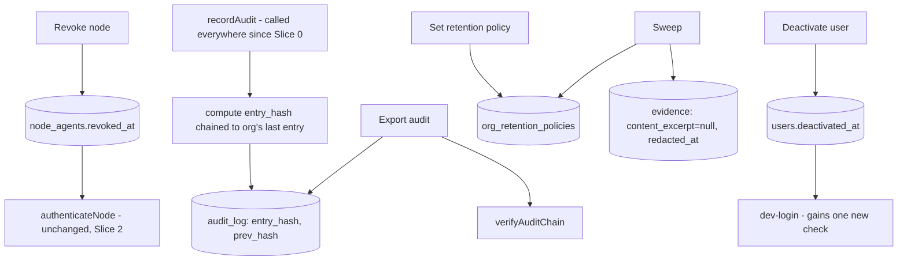

# Slice 9 — Enterprise Hardening Design

**Spec**: `.specs/features/slice-9-enterprise-hardening/spec.md`
**Status**: Approved

---

## Constraints carregadas

`.specs/STATE.md` Decisions (AD-001..006), todas `active`, nenhuma em conflito — este design as segue sem superseder nenhuma. Nenhuma lição confirmada existe ainda.

## Abordagem

Uma única abordagem é viável: cada uma das 5 histórias fecha uma lacuna concreta já identificada em código ou schema existente (o `revoked_at` que o Slice 2 lê mas nunca escreve; o `audit_log` que toda rota já grava mas nunca encadeia; `evidence.content_excerpt` já nullable, pronto para redação; `users`/`node_agents` já com PK por org). Nenhuma infraestrutura nova é necessária além de colunas/tabelas adicionais no mesmo Postgres. As alternativas descartadas (SSO real, revogação de sessão, KMS, residency) já foram registradas como Out of Scope na fase Specify.

## Architecture Overview



---

## Code Reuse Analysis

| Componente | Location | How to Use |
| --- | --- | --- |
| `recordAudit`/`AuditEntry` | `apps/hub/src/policy/policy.ts` (Slice 0) | Interface pública INALTERADA - a cadeia de hash é computada e persistida DENTRO de `recordAudit`, então nenhum dos ~20+ call sites em todo o sistema (toda `enforceCapability` desde o Slice 0) precisa mudar |
| `canonicalJson` | `apps/hub/src/platform/canonical-json.ts` (Slice 4) | Reusado sem alteração para computar `entry_hash` de forma determinística |
| `authenticateNode`, `revoked_at` (coluna já existente) | `apps/hub/src/nodes/auth.ts` (Slice 2) | ZERO alteração - já nega autenticação quando `revoked_at` não é null; este slice só adiciona a rota que ESCREVE nesse campo |
| `evidence.content_excerpt` (já nullable) | `apps/hub/migrations/004_evolution.sql` (Slice 3) | Redação é só um `UPDATE ... set content_excerpt = null`; nenhuma migração de schema para esse campo, só a nova coluna `redacted_at` |
| `requireOwnedProject`, `enforceCapability`, `withTx`, `requireScope` | Slices 0-8 | Reusados sem alteração nas rotas novas |
| Padrão "capability única por domínio" | `capability_grants` (Slice 0) | `admin.write` cobre as 4 ações de escrita deste slice |

### Integration Points

| System | Integration Method |
| --- | --- |
| PostgreSQL | Migration `010_hardening.sql` |

---

## Components

### apps/hub — policy/policy.ts (extensão)

- **Purpose**: Encadear cada novo `audit_log` entry com o anterior do mesmo org; expor verificação e export da cadeia.
- **Location**: `apps/hub/src/policy/policy.ts`
- **Interfaces**: `recordAudit` (assinatura inalterada, agora computa `entry_hash`/`prev_hash` internamente); `verifyAuditChain(pool, orgId): Promise<{valid: boolean, brokenAtId?: number}>`; `exportAuditLog(pool, orgId): Promise<{entries: AuditLogRow[], chainValid: boolean}>`.
- **Dependencies**: `canonicalJson`.
- **Reuses**: nenhuma mudança de assinatura pública em `recordAudit`/`AuditEntry`.

### apps/hub — evolution/hardening.ts (novo)

- **Purpose**: Node fleet (listar/revogar), política de retenção + sweep de evidência, desprovisionamento de usuário.
- **Location**: `apps/hub/src/evolution/hardening.ts`
- **Interfaces**: `POST /orgs/current/nodes/:nodeId/revoke`; `GET /orgs/current/nodes`; `GET /orgs/current/audit/export`; `POST /orgs/current/retention`; `POST /orgs/current/retention/sweep`; `POST /orgs/current/users/:userId/deactivate`; `GET /orgs/current/users`.
- **Dependencies**: `policy/policy` (`verifyAuditChain`, `exportAuditLog`).
- **Reuses**: `withTx`, `requireScope`, `enforceCapability`.

**Nota sobre escopo de rota**: todas as rotas deste slice são org-scoped (`/orgs/current/...`), reusando o mesmo padrão já estabelecido pelo registry de módulos privado do Slice 7 — o org sempre vem de `scope.orgId`, nunca de um parâmetro de path.

**Nota sobre `dev-login`**: o único ponto tocado FORA de `hardening.ts`/`policy.ts` é uma checagem adicional em `apps/hub/src/server.ts`'s `POST /auth/dev-login` (`deactivated_at is null`), mantendo o resto da rota inalterado.

---

## Data Models (SQL — `apps/hub/migrations/010_hardening.sql`)

```sql
alter table audit_log add column entry_hash text;
alter table audit_log add column prev_hash text;

alter table evidence add column redacted_at timestamptz;

alter table users add column deactivated_at timestamptz;

create table org_retention_policies (
  org_id text primary key,
  evidence_retention_days int not null,
  updated_at timestamptz not null default now()
);
```

**Relationships**: `audit_log.prev_hash` referencia o `entry_hash` do entry anterior do MESMO `org_id` (nunca globalmente) - não é uma FK formal (mesmo espírito de `harness_eval_runs.inventory_version`, um vínculo de auditoria por valor, não por constraint). `node_agents.revoked_at` e `evidence.content_excerpt`/`content_digest` já existem desde os Slices 2/3 - este slice só os usa pela primeira vez do lado de escrita/redação. `org_retention_policies` é 1:1 com `organizations`, sem relação com projeto.

---

## Error Handling Strategy

| Error Scenario | Handling | User Impact |
| --- | --- | --- |
| Revogar Node inexistente/outro org | 404 `not_found` | — |
| Revogar Node já revogado | 200 idempotente, `revoked_at` inalterado | — |
| Configurar retenção com valor não-positivo | 422 `invalid_retention_window` | — |
| Disparar sweep sem política configurada | 422 `retention_not_configured` | — |
| Desativar usuário inexistente/outro org | 404 `not_found` | — |
| Desativar usuário já desativado | 200 idempotente | — |
| `dev-login` de usuário desativado | 401 `identity_deactivated` (distinto de `unknown_identity`) | — |
| Qualquer rota deste slice cross-tenant | 403 `capability_denied` (rotas de escrita) — leitura é org-scoped por construção, nunca vaza outro org | — |

---

## Risks & Concerns

| Concern | Location | Impact | Mitigation |
| --- | --- | --- | --- |
| `audit_log.entry_hash`/`prev_hash` ficam `NULL` para linhas gravadas ANTES deste slice (nenhum backfill) | `apps/hub/migrations/010_hardening.sql` | A cadeia de um org com histórico pré-existente teria um "buraco" no início | Aceito - este ambiente é dev/test (`freshDb` recria o schema do zero a cada suíte), sem dado de produção pré-existente para migrar; um backfill real é trabalho de operação de produção, fora do escopo deste slice |
| `dev-login` só bloqueia NOVAS sessões, nunca invalida uma já emitida (documentado na spec) | `apps/hub/src/server.ts` | Um usuário desativado com uma sessão ainda válida continua agindo até ela expirar (sessões hoje não expiram) | Já documentado como Assumption confirmada na spec, não uma lacuna silenciosa; corrigir exigiria redesenhar todo o pipeline de sessão (fora de escopo) |
| Redigir evidência não invalida o `content_digest` já usado por decisions/claims para referenciar a evidência | `apps/hub/src/evolution/hardening.ts` (sweep) | Nenhum - é o comportamento desejado: a prova de que algo existiu (digest) sobrevive, só o conteúdo sensível é removido | Nenhuma mitigação necessária, é o design pretendido |

---

## Tech Decisions (only non-obvious ones)

| Decision | Choice | Rationale |
| --- | --- | --- |
| Hash da cadeia computado DENTRO de `recordAudit`, assinatura pública inalterada | Nenhum call site (20+ em todo o sistema) precisa mudar | "Reuse is king" levado ao extremo - a alternativa (mudar a assinatura de `AuditEntry` para exigir o hash do caller) exigiria tocar toda rota do sistema desde o Slice 0 |
| Cadeia por org, não global | `prev_hash` busca o último entry do MESMO `org_id` | Mantém a verificação O(entries do org) e consistente com todo o resto do sistema sendo tenant-scoped; uma cadeia global exigiria serializar escritas entre orgs, contradizendo multi-tenancy |
| Redação nunca deleta a linha de evidência | `UPDATE ... set content_excerpt = null, redacted_at = now()` | Mesmo padrão "nunca apagar, sempre marcar" dos Slices 6/7; deletar quebraria qualquer `claim_evidence`/referência de decision que aponte para aquela evidência |
| `dev-login` ganha uma checagem adicional em vez de uma rota nova | Uma linha a mais na query existente (`and deactivated_at is null`) | Menor superfície de mudança; a rota de login não precisa de um segundo caminho |

Decisão de projeto-level: **nenhuma** — reuso de `recordAudit`/`canonicalJson`/`revoked_at` são aplicações de convenções e schema já estabelecidos (Slices 0, 2, 3, 4), não uma convenção nova.

---

## Review do slice (checklist de `docs/06-delivery/05-build-sequence.md`)

| Pergunta | Resposta |
| --- | --- |
| Usuário entende o valor? | Sim — um admin de org agora consegue desligar um Node comprometido na hora (kill switch), provar que o audit trail não foi adulterado (cadeia tamper-evident + verificação com o ponto exato de qualquer quebra), exportar essa trilha para uma auditoria externa, aplicar uma janela de retenção que redige evidência antiga sem apagar a proveniência, e desprovisionar um usuário que saiu — exatamente os controles de incident response/compliance que o threat model §12 e os NFR-SEC-001/006/010 exigem antes de um cliente enterprise confiar dados estratégicos ao produto |
| O novo artifact está no knowledge model? | Não introduz nenhuma entidade nova do knowledge model — este slice é puramente operacional/administrativo (fleet, audit, retenção, identity), então estende colunas/tabelas de suporte (`audit_log.entry_hash/prev_hash`, `evidence.redacted_at`, `users.deactivated_at`, `org_retention_policies`) sem tocar `projects`/`proposals`/`decisions`/`claims` |
| Evidence/decision lineage existe? | Sim, por construção: a redação de evidência (T5) nunca deleta a linha nem toca `claim_evidence`/`decisions` — só `content_excerpt`/`redacted_at` mudam, `content_digest` permanece como prova de que algo existiu; testado diretamente em T5 com uma claim referenciando a evidência redigida, permanecendo íntegra |
| Policy e classification cobrem o fluxo? | Sim — `admin.write` segue o mesmo deny-by-default dos Slices 0-8, concedida aos dois tenants dev na mesma edição (T1); toda rota de escrita deste slice é org-scoped a partir de `scope.orgId` (nunca de um parâmetro de path), o mesmo padrão do registry de módulos privado do Slice 7; leituras (fleet, export, users) não exigem capability própria, só sessão autenticada, decisão já documentada como Assumption confirmada na spec |
| Failure/retry/idempotency definidos? | Sim — revogar um Node já revogado e desativar um usuário já desativado são no-ops idempotentes (`coalesce(..., now())`); configurar uma janela de retenção inválida ou disparar um sweep sem política configurada nunca persiste nada (422 antes de qualquer escrita); revogar/desativar um recurso inexistente ou de outro org é sempre 404, nunca confirma existência cross-tenant |
| Evals incluem negative cases? | Sim: revoke de Node inexistente/outro org/já revogado/sem capability; verificação de cadeia com adulteração direta no meio da cadeia identificando o id exato; export de org vazio e isolamento entre dois orgs; retenção com janela zero/negativa/fracionária/string/null/undefined, sweep sem política configurada, sweep preservando evidência dentro da janela e lineage de claim; deactivate de usuário inexistente/outro org/já desativado, dev-login de usuário desativado (401 `identity_deactivated`) distinto de email desconhecido (401 `unknown_identity`); isolamento cross-org em toda listagem nova (fleet, users) |
| O profile Lite continua possível? | Sim — nenhuma rota deste slice é exigida para o walking skeleton Lite (M0); todas as 5 histórias são operações administrativas Team/Enterprise (fleet management, compliance export, retenção, deprovisioning), consistente com `07-deployment-topologies.md` |
| Alguma hipótese do ecossistema foi invalidada? | Não invalidou nenhum ADR. Nenhum desvio de spec foi encontrado durante o fechamento — a implementação de T1-T6 seguiu a spec/design sem precisar de correção de conformidade. Este é o último slice do roadmap de 10 slices ([build-sequence](../../../docs/06-delivery/05-build-sequence.md)) — com HARD-01..22 implementados e testados, todo o roadmap planejado está coberto por spec-driven execution |
