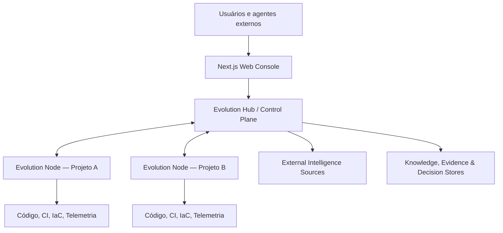
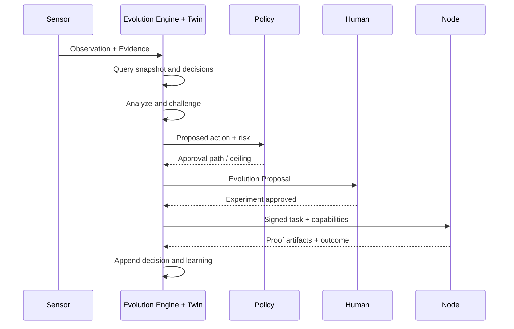

# Arquitetura do sistema

## 1. Visão

EvolutionOS é uma plataforma federada de Control Plane/Data Plane. O Hub coordena conhecimento compartilhado, portfólio, políticas e runs. Nodes observam e atuam perto dos projetos. Módulos estendem ambos por contratos estáveis.

## 2. Bounded contexts

### Identity & Tenancy

Users, service accounts, Nodes, organizations, workspaces, memberships and workload identities.

### Project Registry

Projects, relationships, owners, manifests, artifacts, baselines, snapshots and coverage.

### Evidence & Intelligence

Sources, observations, evidence, claims, signals, findings, lineage and confidence.

### Evolution Management

Proposals, decisions, review triggers, campaigns, experiments, changes and outcomes.

### Agentic Runtime

Runs, plans, tasks, context bundles, agents, skills, tools, models, checkpoints and proof artifacts.

### Policy & Governance

Capabilities, policies, approvals, exceptions, classification, retention and audit.

### Module Registry

Packages, versions, signatures, compatibility, installations, rollouts and quarantine.

### Integration Gateway

Connectors, MCP servers, webhooks, sync cursors, secret references and quotas.

### Experience & Reporting

Views, inboxes, dashboards, subscriptions, exports and notifications.

## 3. Componentes do Control Plane

- **API Gateway/BFF contract:** autenticação, rate limit e composição.
- **Project Service:** Registry e Twin authoritative state.
- **Evidence Service:** ingestion, lineage e immutable references.
- **Evolution Service:** findings, proposals, decisions e campaigns.
- **Orchestrator:** durable workflows, checkpoints e tasks.
- **Policy Decision Point:** avalia capabilities e approval paths.
- **Module Registry:** metadata e lifecycle de pacotes.
- **Connector Gateway:** integrações externas e MCP brokering.
- **Scheduler/Event Router:** eventos e periodicidade.
- **Search/Graph Projection:** consultas transversais e impacto.
- **Notification Service:** inbox e canais externos.
- **Audit/Telemetry:** trilha e observabilidade.

No MVP, esses componentes vivem em um **modular monolith com workers separados**, fronteiras internas e eventos. Microservices são opção de evolução, não ponto de partida.

## 4. Componentes do Node

- Node API/CLI.
- Manifest and configuration manager.
- Local sensor runtime.
- Analyzer runtime.
- Policy enforcement point.
- Capability broker.
- Agent adapter/model router.
- Sandbox/experiment runner.
- Local cache/state/spool.
- Sync agent.
- Local MCP facade opcional.
- Audit and OTel emitter.

## 5. Dados

### System of record

PostgreSQL mantém identidades, workflows, proposals, decisions, policies, module installations e estados transacionais.

### Graph projection

Uma projeção navegável representa entidades e relações para impact analysis. O MVP pode usar edge tables e recursive queries; um graph store dedicado é habilitado quando escala/latência justificarem.

### Evidence/object store

Conteúdo bruto, reports, snapshots grandes e proof artifacts vivem em object storage com hash, classificação e retenção.

### Search/vector index

Índice derivado para full-text e semantic retrieval. Nunca é fonte de verdade e pode ser reconstruído.

### Event log

Eventos de domínio e outbox suportam integrações, projeções e durable orchestration. Audit record material é separado de observability logs.

## 6. Fluxo end-to-end

## 7. Princípios de integração

- APIs para queries e commands síncronos curtos.
- Eventos para mudança de estado e integração assíncrona.
- Durable workflows para runs longos.
- MCP para ferramentas/contexto de agentes, não para comunicação interna indiscriminada.
- A2A somente na fronteira com aplicações agentic independentes quando houver necessidade real.
- CloudEvents como envelope de eventos externos e internos interoperáveis.
- OpenTelemetry para telemetry, nunca como audit source of truth.

## 8. Consistência

- Strong consistency para decisions, approvals, policies e capability grants.
- Transactional outbox para evento após mudança authoritative.
- Eventual consistency para search, graph projections, dashboards agregados e Node sync.
- Optimistic concurrency para manifests e artifacts humanos.
- Idempotency keys para commands e tool calls mutáveis.

## 9. Evolução de arquitetura

Sinais de extração de componente:

- escala ou SLO independente;
- boundary de segurança/residência;
- cadence de deployment incompatível;
- ownership independente maduro;
- workload especializado;
- necessidade de isolamento de falhas.

Não extrair por tamanho de arquivo, moda ou antecipação abstrata.
