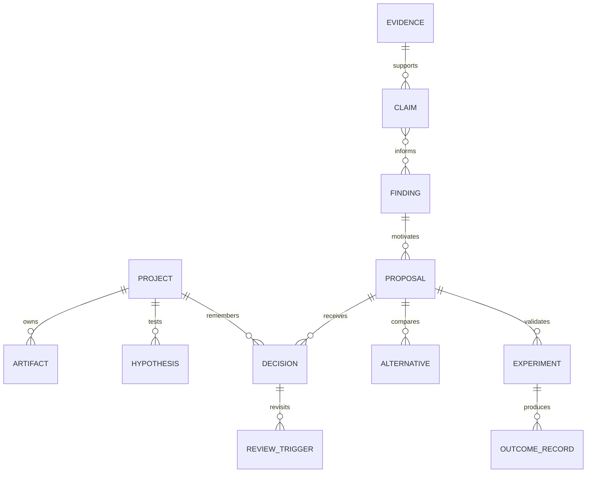

# Modelo de conhecimento e memória

## 1. Objetivo

O modelo deve responder perguntas de impacto sem confundir documentação, inferência e realidade observada. Ele é um graph-shaped domain model persistido por fontes especializadas.

## 2. Entidades principais

### Project domain

- Organization, Workspace, Project, ProjectVersion.
- Goal, Outcome, Metric, Constraint, Hypothesis.
- Person, Team, Ownership.
- Artifact, ArtifactVersion, Source.

### Architecture/implementation

- System, Component, Service, Repository, Module, Package.
- API, Event, Topic, DataStore, Dataset, InfrastructureResource.
- Dependency, Deployment, Environment.
- ArchitectureModel, ArchitectureRule, FitnessFunction.

### Agentic/harness

- Harness, AgentDefinition, Model, Provider.
- PromptBundle, Skill, MCPServer, Tool, Hook, MemoryPolicy.
- EvalSuite, EvalCase, EvalRun, DatasetVersion.

### Intelligence

- Observation, Evidence, Claim, Signal, Finding.
- Proposal, Alternative, Impact, Experiment.
- Decision, ReviewTrigger, ChangeSet, Verification, OutcomeRecord.
- Campaign, Cohort, Exception.

### Governance

- Capability, Policy, Approval, Grant, DataClassification.
- ModulePackage, Installation, Attestation.
- AgentRun, Task, ToolCall, AuditRecord.

## 3. Relações essenciais

Outras relações:

- Project `contains`, `implements`, `depends_on`, `replaces`, `influences` Project.
- Artifact `describes`, `governs`, `implements`, `contradicts` Entity.
- Decision `accepts`, `rejects`, `defers`, `supersedes` Proposal/Decision.
- Finding `affects` Entity/Decision/Hypothesis.
- Evidence `corroborates` ou `contradicts` Claim.
- Tool/Skill/Module `used_in` AgentRun.
- Verification `evaluates` ChangeSet against Criterion.

## 4. Quatro estados de verdade

Para evitar falsa certeza, valores podem coexistir:

- **Declared:** alguém ou artifact authoritative declarou.
- **Observed:** sensor encontrou no ambiente.
- **Inferred:** análise derivou com confidence.
- **Expected:** policy/baseline requer.

Exemplo: arquitetura declarada diz que API não acessa banco; código observado mostra dependência; inference relaciona a uma PR; expected rule falha. O sistema não sobrescreve a arquitetura declarada — cria drift finding.

## 5. Bitemporalidade

Entidades críticas usam:

- `valid_time`: quando o fato era verdadeiro no domínio;
- `system_time`: quando EvolutionOS soube/registrou.

Isso permite reconstruir “o que acreditávamos em determinada data” e corrigir observações tardias sem reescrever história.

## 6. Provenance

Cada field/edge derivado registra:

- source/evidence IDs;
- extraction module/version;
- model/prompt/skill versions quando probabilístico;
- timestamp;
- transformation chain;
- confidence components;
- human confirmations/overrides.

Human override não apaga inferência; cria declaração prioritária e, se necessário, finding sobre conflito.

## 7. Confidence

Confidence não é um número isolado. Estrutura mínima:

- source authority;
- source freshness;
- extraction reliability;
- corroboration;
- contradiction;
- context coverage;
- model/eval fitness.

UI pode projetar bands `low`, `medium`, `high`, `verified`, mantendo decomposição.

## 8. Storage strategy

- PostgreSQL: authoritative aggregates e relationships essenciais.
- Object storage: content-addressed evidence/artifacts.
- Search/vector: derivado e rebuildable.
- Graph projection: derivada e rebuildable; dedicated engine opcional.
- Append-only audit: material actions/decisions.

Evitar começar com graph database como única fonte: transactions, migrations, tenancy e workflow state são centrais. Evitar também relegar relações a embeddings: similaridade não substitui semântica.

## 9. Retenção e direito de remoção

- Conteúdo bruto segue policy e legal basis.
- Hashes/provenance podem permanecer quando permitido para audit.
- Derivados ligados a conteúdo removido são marcados `source_unavailable` e reavaliados.
- Export inclui classificação e referências, não secrets.
- Tenant deletion possui workflow comprovável.

## 10. Perguntas que o modelo deve responder

- Quais decisões dependiam de uma versão de framework agora em EOL?
- Que produtos usam uma feature tornada commodity?
- Quais MCPs têm capability de escrita e não possuem eval recente?
- Que serviços violaram um baseline arquitetural após certa PR?
- Qual evidência levou à rejeição de uma migração e o trigger ocorreu?
- Quais proposals compartilham causa e podem virar campaign?
- Que findings derivam de uma fonte removida ou baixa confiança?

