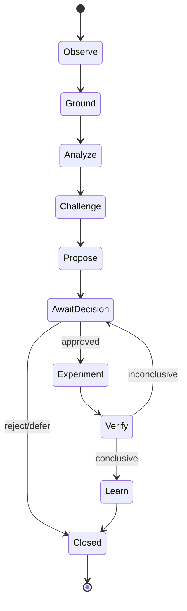

# Runtime agentic

## 1. Objetivo

Coordenar agentes especializados em workflows longos, reproduzíveis e governados. O runtime não presume que mais agentes geram melhor resultado; cada papel existe para separar responsabilidades ou reduzir um risco específico.

## 2. Primitivas

- **Run:** execução end-to-end com objetivo, snapshot e budget.
- **Plan:** DAG versionado de tasks.
- **Task:** unidade leaseable e idempotente.
- **Agent role:** policy/instruction profile, não identidade de usuário.
- **Context bundle:** referências mínimas selecionadas e classificadas.
- **Capability grant:** permissões temporárias para tools.
- **Checkpoint:** estado durable entre etapas/model context windows.
- **Artifact:** output estruturado com schema e provenance.
- **Proof:** artifact que comprova verificação.
- **Intervention:** pergunta, aprovação ou correção humana.

## 3. Loop principal

## 4. Orchestrator

Responsável por:

- validar objective e snapshot;
- escolher workflow profile;
- formar DAG e budgets;
- pedir policy decisions;
- dispatch de tasks;
- checkpoints, retries e compensation;
- aggregar artifacts;
- encaminhar human interventions;
- fechar run somente após terminal state consistente.

O Orchestrator não decide mérito do produto ou arquitetura; delega a specialists e requer Challenger/Verifier conforme risco.

## 5. Context assembly

1. Task declara required context types.
2. Context Broker consulta Project Twin por entidades e decisions.
3. Policy filtra dados por role/capability/classification.
4. Retriever seleciona evidence e artifacts por regras híbridas: IDs/graph/full-text/semantic.
5. Bundle recebe token/size budget, lineage e expiry.
6. Agent recebe referências; conteúdo adicional é carregado sob demanda.

Embeddings não decidem autorização. Retrieval nunca amplia acesso.

## 6. Skills e tools

- Catálogo inicial carrega nome/descrição das skills permitidas.
- Skill completa é ativada somente quando task e policy correspondem.
- Tool discovery é filtrada por capability e fase.
- O agente não vê ferramentas de escrita em task read-only.
- MCP gateway fornece nomes estáveis e scopes; raw third-party tools não são entregues diretamente.

## 7. Model routing

Model Router considera:

- task type e risco;
- eval eligibility;
- data residency;
- context modality/size;
- latency/cost budget;
- provider availability;
- policy allowlist.

Fallback só ocorre entre modelos previamente qualificados para a task. Uma indisponibilidade não autoriza usar provider proibido.

## 8. Durable execution

Runs podem durar minutos ou dias. Estado essencial vive fora do context window. Cada task produz artifact estruturado e summary de handoff; não depende do histórico completo da conversa.

Retries:

- read-only: retry com backoff e limit;
- deterministic idempotent write: retry por token;
- uncertain side effect: consultar status/reconcile;
- model failure: retry controlado ou fallback qualificado;
- policy denial: terminal até mudança explícita.

## 9. Challenger pattern

Para proposals materiais, Challenger recebe:

- evidence set;
- project constraints;
- proposed claim/alternative sem linguagem persuasiva;
- checklist de causalidade, hype, missing costs, contradiction e non-action.

Seu output não “vence”; é incorporado como counter-analysis. Conflito pode exigir humano.

## 10. Human-in-the-loop

Intervenções são eventos durable com SLA, recipients e expiration. O run pode:

- esperar;
- seguir por safe default;
- reduzir escopo;
- expirar;
- cancelar e compensar.

Nunca presumir aprovação por silêncio para mudança material.

## 11. Budgeting

Cada run possui limites:

- monetary cost;
- model tokens/calls;
- tool calls;
- wall-clock;
- compute;
- external source queries;
- maximum write actions.

Budget extension exige policy ou aprovação. Loop sem progresso é detectado por repeated state/artifact similarity e encerrado.

## 12. Output contracts

Agentes retornam artifacts validados por schema. Texto livre pode acompanhar, mas não conduz workflow. Falha de schema aciona repair limitado e depois `invalid_output`.

## 13. Auto-evolução

Prompts, skills, routing policies e agent definitions são versionados como harness project. Mudança passa por offline eval, shadow, canary e promotion. Runtime nunca modifica sua própria policy em produção durante a mesma run.

