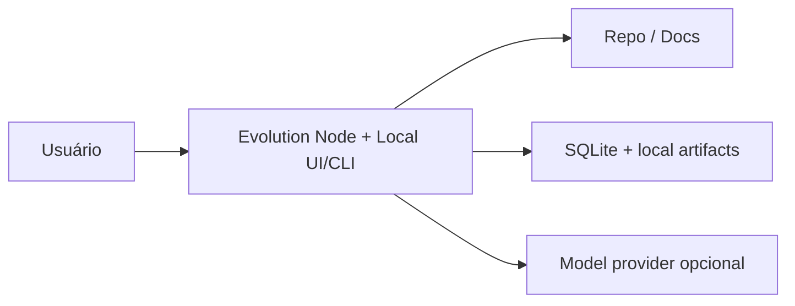
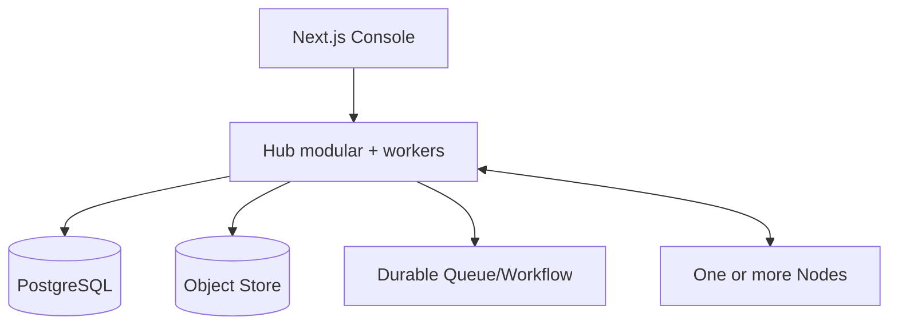

# Topologias de implantação

## 1. Princípio

Um produto, vários perfis. Project manifest, evidence, proposal, module e event contracts não mudam entre perfis.

## 2. Lite / local

Características:

- single binary/container ou pacote local;
- SQLite/local files;
- scheduler local;
- modules locais;
- UI limitada ou conexão ao web console local;
- sem multi-tenancy;
- export/import para migração.

## 3. Team

Características:

- containerized services;
- PostgreSQL;
- S3-compatible object store;
- event broker/workflow engine;
- OIDC;
- shared policies e modules;
- dezenas/centenas de projetos.

## 4. Enterprise SaaS federado

- multi-tenant Control Plane;
- tenant-isolated encryption, quotas e indexes;
- regional data planes;
- Nodes em customer environment;
- private connectivity opcional;
- customer-managed keys;
- organization module registry;
- SIEM/audit export;
- SSO/SCIM;
- campaign orchestration;
- HA e disaster recovery.

## 5. Enterprise self-hosted

- Hub em Kubernetes ou plataforma corporativa;
- external Postgres/object store/identity/vault;
- broker e OTel existentes;
- registry privado;
- offline update channels;
- deployment profiles certificados.

## 6. Air-gapped

- Hub/Node sem internet;
- intelligence bundles importados com assinatura;
- models locais ou approved endpoints;
- offline module registry mirror;
- export audit/proposals por bundle;
- source freshness claramente marcada.

## 7. Hybrid data residency

Workspace escolhe região. Node executa restricted analyzers localmente. Hub global recebe apenas aggregate metadata autorizado. Cross-region relationship mostra existência/IDs somente quando permissionado.

## 8. Scaling units

- API/web replicas por request load.
- Workers por task queue/classification.
- Connector workers por provider/rate limit.
- Agent execution por budget e model quota.
- Graph/search projection por tenant shards.
- Node pools por environment/security zone.

## 9. Build vs buy boundaries

EvolutionOS não deve criar de início:

- identity provider;
- secret vault;
- generic workflow engine;
- generic event broker;
- full observability backend;
- SCM;
- OCI registry.

Ele integra implementações por adapters e oferece defaults de desenvolvimento.

## 10. Upgrade strategy

- Schema migrations backward-compatible primeiro.
- Hub suporta pelo menos current e previous Node protocol.
- Module rollout canary por cohort.
- Feature flags para capabilities novas.
- Rollback preserva artifacts e event compatibility.
- Data migration possui dry-run e verification.

## 11. Critérios de escolha de perfil

| Necessidade | Lite | Team | Enterprise |
|---|---:|---:|---:|
| Um projeto local | ✓ | ✓ | ✓ |
| Portfolio dashboard | — | ✓ | ✓ |
| Multi-tenant | — | Opcional | ✓ |
| Air-gap | ✓ | Opcional | ✓ |
| Central policies | Local | ✓ | ✓ federado |
| Thousands of repos | — | — | ✓ |
| Customer-managed keys | Local | Opcional | ✓ |

