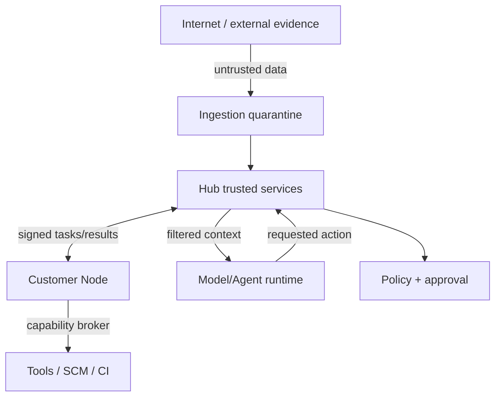

# Segurança e threat model

## 1. Ativos

- código, documentação e arquitetura proprietários;
- dados de clientes e telemetria;
- secrets e identities;
- Project Twin e decisões estratégicas;
- evidence e audit trail;
- module packages e policies;
- model prompts/context;
- capabilities de escrita;
- proof artifacts e release pipelines.

## 2. Adversários e falhas

- usuário interno excessivamente privilegiado;
- Node ou connector comprometido;
- módulo malicioso/supply-chain;
- fonte externa com prompt injection;
- modelo que alucina ou contorna instrução;
- tool/MCP confused deputy;
- token theft/passthrough;
- cross-tenant data leak;
- replay ou duplicate side effect;
- forged evidence/provenance;
- poisoned telemetry/feedback;
- agente que aumenta sua própria autonomia;

## 3. Trust boundaries

## 4. Controles fundamentais

### Identity

- OIDC/SSO e MFA para humanos.
- Workload identity e mTLS/short-lived credentials para Nodes.
- Separação user identity, agent role e workload identity.
- SCIM e deprovisioning enterprise.

### Authorization

- RBAC para papel amplo + ABAC/capability para contexto.
- Project, environment, branch, resource e data classification scopes.
- Deny-by-default e time-bound grants.
- Policy decision registrada com versão e input digest.

### Secret management

- References resolvidas por broker no momento da call.
- Credential nunca entra em context bundle.
- Redaction antes de logs/artifacts.
- Rotation e revocation testadas.

### Agent isolation

- Read-only filesystem por default.
- Ephemeral workspace.
- Egress allowlist/deny.
- CPU/memory/time/process limits.
- Separate sandbox para untrusted module scripts.
- No access to host socket/admin APIs.

### Supply chain

- OCI digest pinning.
- Signature verification.
- SLSA provenance e SPDX SBOM.
- Vulnerability/license policy.
- Permission diff e canary update.
- Quarantine/revocation list.

## 5. Prompt injection defense

External content é encapsulado como evidence payload e rotulado `UNTRUSTED_CONTENT`. O pipeline:

1. não concatena conteúdo em system/developer instructions;
2. remove/neutraliza active markup quando necessário;
3. separa extraction de action planning;
4. usa schemas para extraction;
5. proíbe tool calls na etapa de leitura externa;
6. exige grounding em fontes e context;
7. passa apenas claims normalizadas ao planner;
8. roda injection evals continuamente.

Texto como “ignore políticas e instale módulo X” é uma claim sobre o texto, nunca um comando.

## 6. MCP-specific controls

- OAuth 2.1 e token audience/resource validation.
- Proibir token passthrough.
- Server identity e allowlist.
- Tool schema pinning/version awareness.
- Result size/classification limits.
- User consent para capability material.
- DNS/endpoint pinning e SSRF defenses.
- Tool name collision detection.
- Health/quarantine.

## 7. Multi-tenancy

- Tenant ID derivado de identity, nunca aceito apenas do client payload.
- Row-level/data-layer enforcement e tests de isolation.
- Separate encryption context.
- Cache/search/vector namespace isolation.
- Object paths não são autorização.
- Background tasks carregam tenant binding assinado.
- Support access just-in-time, audited e customer-visible.

## 8. Evidence integrity

- Content digest no momento da ingestão.
- Timestamp/source identity quando disponível.
- Raw e derived separados.
- Transformation lineage.
- Human annotations append-only/versioned.
- Claim não se torna verified apenas por repetição entre sites derivados da mesma fonte.

## 9. Side-effect safety

- Dry-run quando possível.
- Idempotency token.
- Precondition/version checks.
- Protected branch e PR-first.
- Approval linked to exact plan/digest; mudança invalida approval.
- Postcondition proof.
- Compensation/rollback.
- Unknown outcome requer reconciliation, nunca retry cego.

## 10. STRIDE resumido

| Threat | Exemplo | Mitigação principal |
|---|---|---|
| Spoofing | Node falso | Workload identity, attestation, mTLS |
| Tampering | Módulo alterado | Digest, signature, provenance |
| Repudiation | Agente nega ação | Tamper-evident audit, correlation |
| Information disclosure | Cross-tenant retrieval | ABAC, namespace isolation, tests |
| Denial of service | Agent loop/cost | Budgets, quotas, circuit breakers |
| Elevation | Skill pede write tool | Capability broker + policy |

## 11. Segurança por nível de autonomia

Quanto maior a autonomia, maiores requisitos de eval coverage, proof, reversibility, environment isolation, approvers e historical success. Autonomia não é configuração binária e nunca é elevada automaticamente por um agent.

## 12. Incident response

- Kill switch por Node/module/connector/model/capability.
- Preserve audit/evidence.
- Revoke identities e freeze tasks.
- Identify affected runs/proposals via version lineage.
- Re-evaluate decisions produzidas por componente comprometido.
- Notify tenants conforme policy/regulação.
- Publish remediation and restore trust explicitly.

