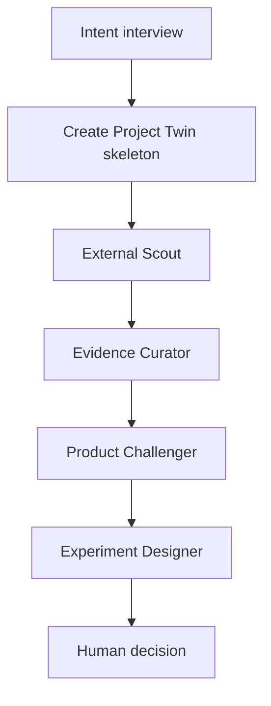
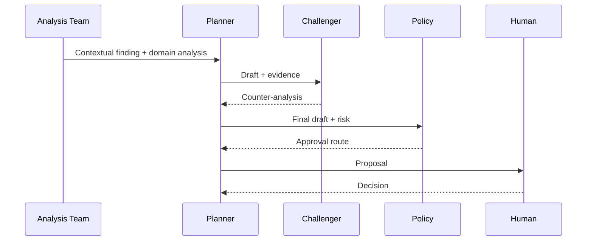

# Orquestrações agentic

## WF-01 — Onboarding de ideia

Gates:

- problem and audience explicit;
- hypothesis type/metric;
- sources classified;
- experiment has kill/continue criteria.

## WF-02 — Repository discovery

1. Node validates permission and manifest.
2. Deterministic sensors collect metadata, SBOM, folders, CI and IaC.
3. Cartographer proposes entities/relations.
4. Architecture Analyzer identifies declared/observed gaps.
5. Human confirms material boundaries.
6. Twin snapshot is published.

No write tools are available.

## WF-03 — Continuous signal triage

1. Sensor event.
2. Dedup and source check.
3. Evidence Curator extracts claims.
4. Relevance Analyst queries affected projects.
5. Low relevance becomes dismissed/watch with reason.
6. Material finding routes to specialist workflow.

Batching avoids uma run por notícia por projeto.

## WF-04 — Evolution Proposal

Proposal sem required evidence permanece `draft/investigate`.

## WF-05 — Experiment

1. Decision authorizes exact experiment spec.
2. Node reserves sandbox and capabilities.
3. Execution Coordinator creates variant/change.
4. Verifier checks setup before run.
5. Experiment executes with guardrails.
6. Verifier compares result and baseline.
7. Human chooses adopt/reject/extend.
8. Memory Custodian records outcome.

## WF-06 — Change implementation

- Approved plan digest binds task.
- Deterministic recipe preferred.
- Coding agent handles residual change.
- PR created as draft.
- CI, security, architecture and eval gates.
- Human review/merge unless policy grants low-risk automation.
- Post-deploy verification and rollback window.

## WF-07 — Harness evolution

1. Inventory current harness.
2. Trigger: model/tool/skill update or regression.
3. Harness Auditor forms hypotheses.
4. Security Analyst checks permissions/data change.
5. Experiment Designer builds task dataset/variants.
6. Offline eval → shadow → canary.
7. Promote/rollback.
8. Deprecate redundant artifacts only after proof.

## WF-08 — Architecture baseline change

Distinct from drift remediation:

1. Finding indicates baseline may no longer fit.
2. Architecture Analyst compares alternatives and NFRs.
3. Impact graph identifies affected systems/teams.
4. Planner creates architecture proposal + ADR draft.
5. Architecture owner approves exact baseline revision.
6. Fitness functions and documentation change first or atomically.
7. Implementation campaign follows.

## WF-09 — Enterprise campaign

1. Find common cause.
2. Build cohort by verified characteristics.
3. Select diverse canaries.
4. Learn transformation recipe and failure taxonomy.
5. Waves with approval/exception.
6. Pause on guardrail breach.
7. Aggregate outcomes and update organization baseline.

## WF-10 — Incident-driven learning

1. Import incident facts/timeline.
2. Link impacted components and prior decisions.
3. Root cause claims require evidence and human confirmation.
4. Actions become proposals, tests or fitness functions.
5. Verification must reference incident failure mode.

## Workflow invariants

- Snapshot/version pinned at analysis start.
- Material change after approval invalidates approval.
- Every side effect has idempotency/reconciliation.
- Every terminal run explains partial failures.
- Human input is versioned artifact, not chat text only.
- Agent cannot skip Challenger/Verifier gate required by policy.
