# Atlas de diagramas

Todos os diagramas são fontes Mermaid versionáveis. Eles complementam, não substituem, contratos e ADRs.

## D01 — Contexto do ecossistema

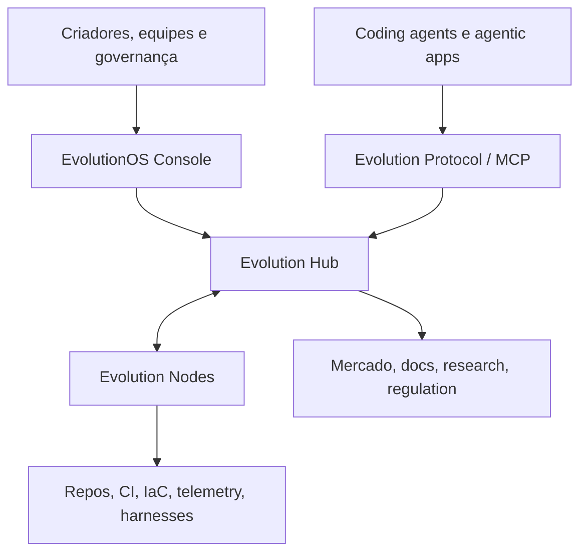

## D02 — Control Plane e Data Plane

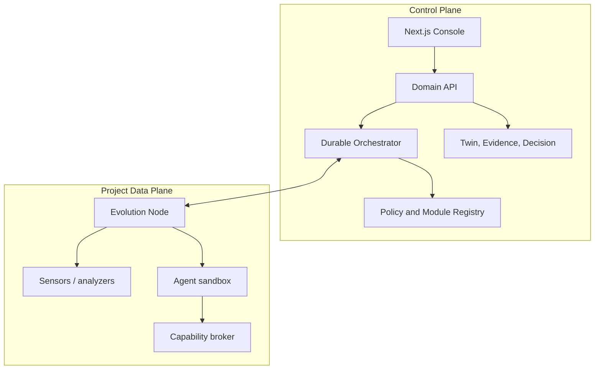

## D03 — Ciclo de evolução

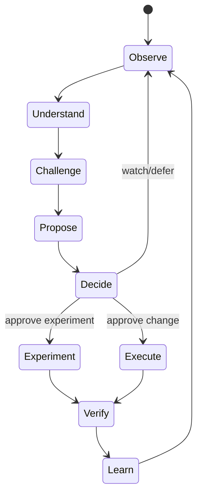

## D04 — Evidence lineage

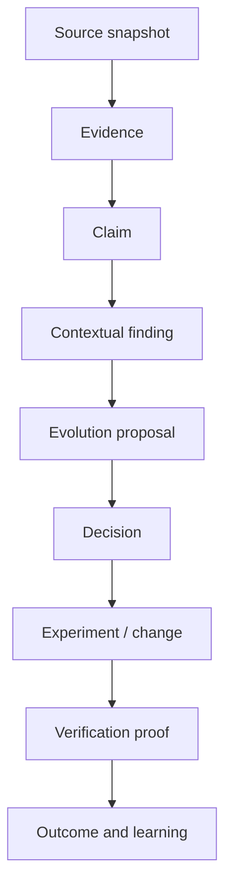

## D05 — Estados de verdade

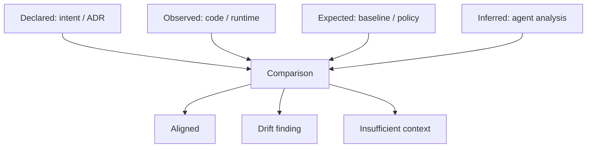

## D06 — Pacote modular

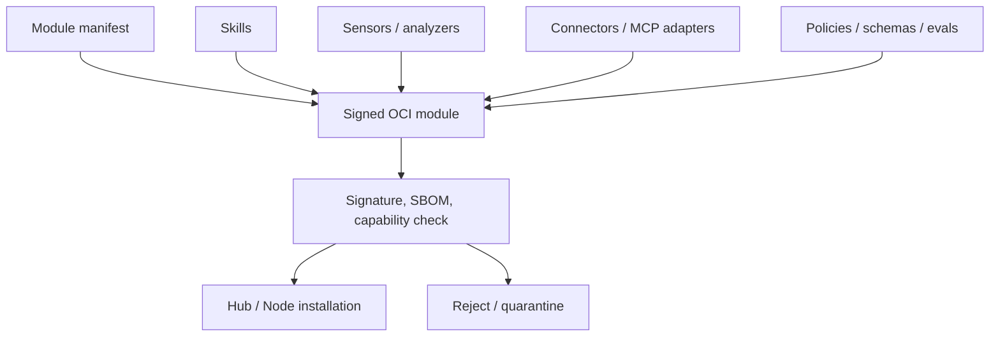

## D07 — Tool/capability mediation

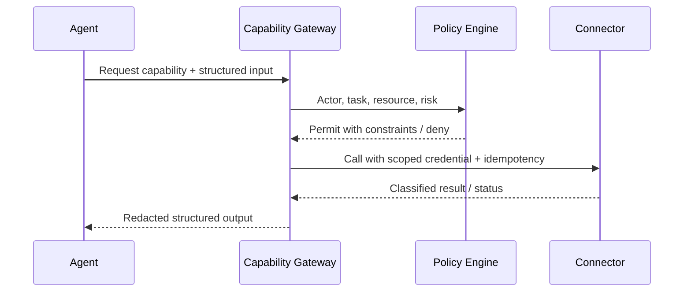

## D08 — Autonomia progressiva

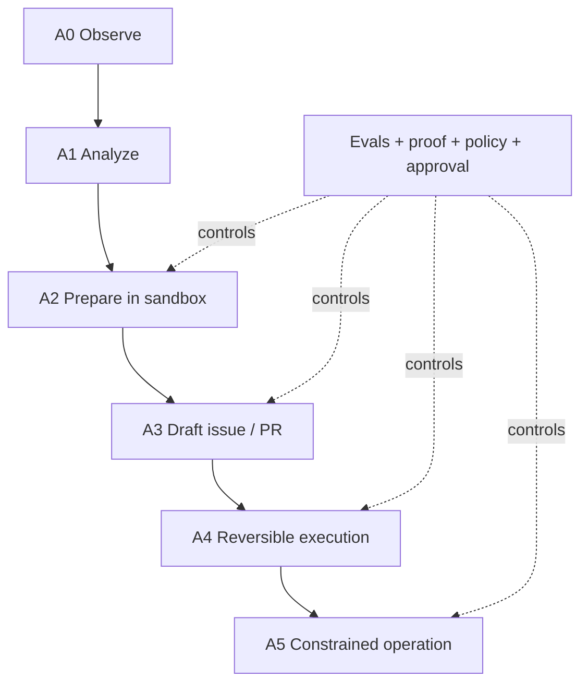

## D09 — Evolution Proposal decision tree

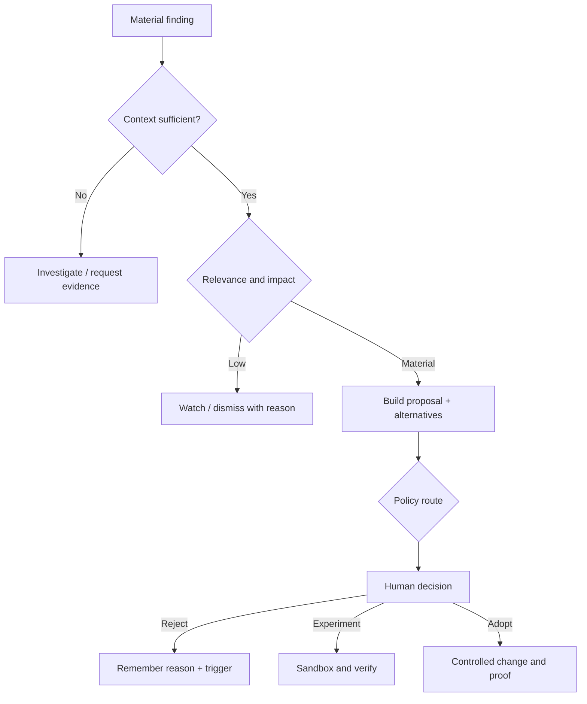

## D10 — Campaign enterprise

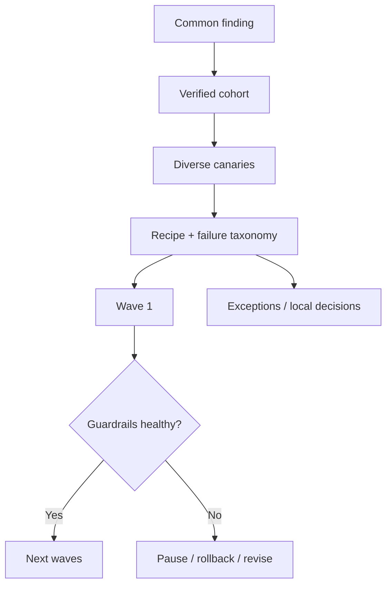

## D11 — Harness observatory

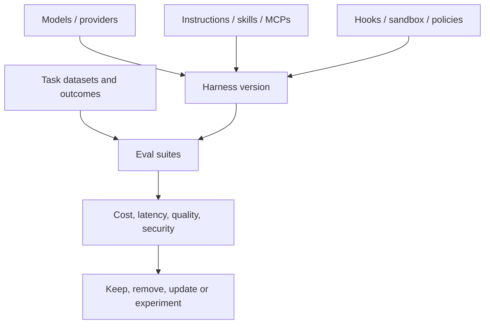

## D12 — Next.js experience boundary

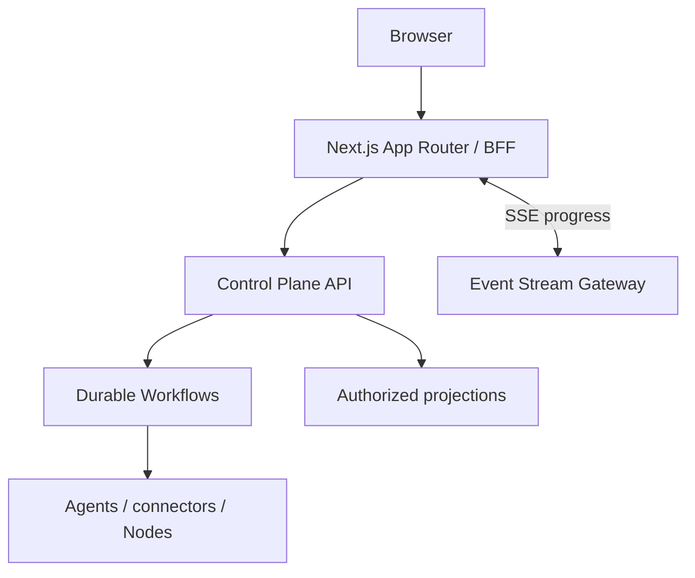

## D13 — Deployment profiles

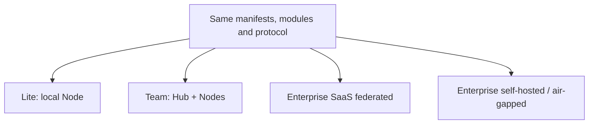

## D14 — EvolutionOS monitora a si próprio

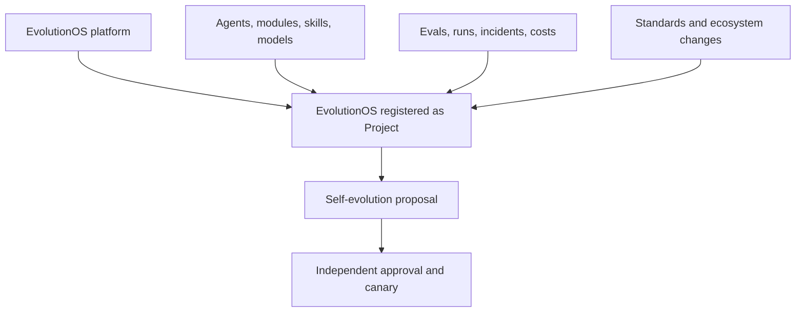
