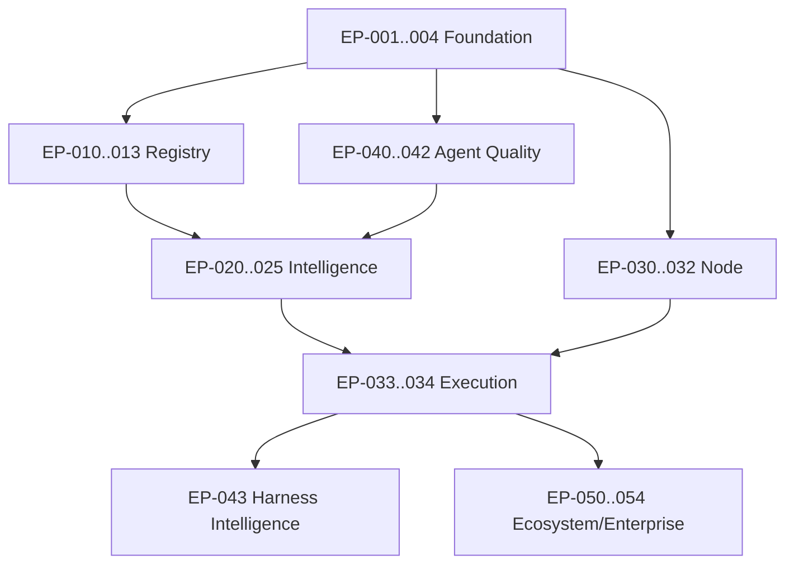

# Épicos de implementação

## Foundation

### EP-001 — Repository and governance foundation

ADRs, modules boundaries, CI, schema validation, docs checks, threat baseline.

### EP-002 — Identity, tenancy and capabilities

Organizations/workspaces, memberships, workload identity, deny-by-default policy, audit.

### EP-003 — Event/outbox/workflow platform

CloudEvents envelope, outbox/inbox, durable runs/tasks/interventions, idempotency.

### EP-004 — Observability and cost

OTel, trace model, audit correlation, budgets and usage ledger.

## Project memory

### EP-010 — Project Registry

Types, manifests, owners, intents, constraints, lifecycle.

### EP-011 — Artifact and decision memory

Artifacts/versioning, ADR/spec links, decisions, triggers, supersession.

### EP-012 — Knowledge relationships and projection

Typed edges, bitemporal facts, graph/search projections, impact queries.

### EP-013 — Project onboarding UX

Idea/repo/portfolio wizards, coverage, confirmation and conflict handling.

## Evidence and intelligence

### EP-020 — Evidence store and lineage

Observation/evidence/claim models, content digests, raw/derived, classification.

### EP-021 — Source ingestion

Manual, URL snapshot and local artifact sources; quarantine and dedup.

### EP-022 — Project Cartographer

Deterministic discovery + agent entity/relationship proposal.

### EP-023 — Evolution Engine

Linking, dimension scoring, finding lifecycle, duplicate/supersession.

### EP-024 — Specialist and Challenger agents

Product, architecture and harness profiles with structured outputs.

### EP-025 — Proposal and decision workflow

Proposal schema, Inbox, approvals, decisions and memory guards.

## Node and execution

### EP-030 — Evolution Node runtime

CLI/daemon, config, local state, modules, health and standalone mode.

### EP-031 — Hub/Node protocol

Enrollment, heartbeat, task dispatch, sync, offline spool and compatibility.

### EP-032 — Sandbox and capability broker

Resource/egress isolation, credentials, dry-run and side-effect mediation.

### EP-033 — Experiment and proof

Experiment specs, variants, verification plans and proof artifacts.

### EP-034 — SCM connector and draft PR

GitHub first, normalized read/write capabilities, webhook and reconciliation.

## Agentic quality

### EP-040 — Agent registry and skill activation

Versioned definitions, progressive disclosure, context bundles and model router.

### EP-041 — Eval platform

Datasets, cases, runners, deterministic/LLM/human rubrics, release comparison.

### EP-042 — Run Explorer

Trajectory, tool/policy calls, costs, artifacts, replay/reconciliation.

### EP-043 — Harness Intelligence

Inventory, audits, model/skill/MCP experiments and promotion.

## Ecosystem and enterprise

### EP-050 — Module package/registry

Manifest, compatibility, lock, install/update/rollback, signature/SBOM.

### EP-051 — Policy and approval console

Simulation, explanations, exceptions, autonomy and segregation.

### EP-052 — Portfolio and campaigns

Aggregations, cohorts, canaries, waves, exceptions and outcomes.

### EP-053 — Enterprise controls

SSO/SCIM, KMS, residency, retention, support access, audit export.

### EP-054 — Self-hosted/air-gap

Deployment profile, offline bundles, private registries and upgrades.

## Dependency backbone

## Definition of Ready para um épico

- PRD/requisitos/ADRs identificados.
- Threat/data boundary definido.
- APIs/events/artifacts propostos.
- Success/guardrails e tests/evals.
- Dependencies and rollback.
- Open questions resolved ou spike explícito.

## Definition of Done

- Functionality + negative paths.
- Contract, security and tenant tests.
- OTel/audit.
- Docs/examples updated.
- Data migration/compatibility.
- Evals and proof.
- Operations/runbook and rollback.

