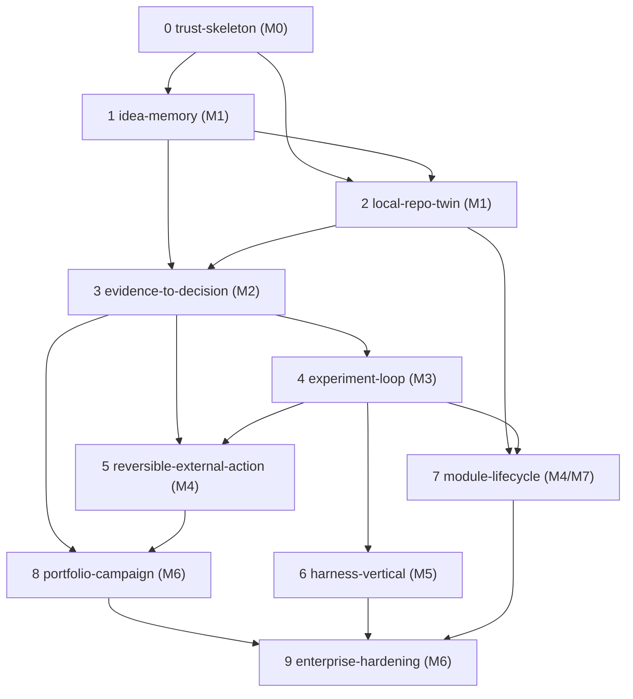

# Plano de execução spec-driven

Converte o [roadmap](01-mvp-and-roadmap.md), os [épicos](02-implementation-epics.md) e a [sequência de construção](05-build-sequence.md) em um backlog de features executáveis pelo método spec-driven (`tlc-spec-driven`). Este é o documento de entrada para qualquer agente ou pessoa que vá construir o EvolutionOS: ele diz qual feature abrir, em que ordem, com quais docs-fonte e quais gates.

## Regras de derivação

1. **A unidade de entrega é o slice vertical** ([AD-002](../../.specs/STATE.md)) — não o milestone nem o épico. Milestones (M0–M7) e épicos (EP-xxx) são eixos de rastreabilidade.
2. **Uma feature por slice**, criada em `.specs/features/<slug>/` somente quando o slice inicia. Specs antecipadas são proibidas: sem a fase Specify real, viram requisitos inventados.
3. **Stop gate do Slice 0**: nenhum desenvolvimento de agente antes do trust skeleton passar (regra da [sequência de construção](05-build-sequence.md)).
4. Toda feature respeita o ritual de fonte de verdade do [`AGENTS.md`](../../AGENTS.md): PRD → ADRs → especificações → requisitos com IDs rastreados.

## Backlog de features

| # | Feature (slug) | Milestone | Épicos | Depende de | Docs-fonte principais | Status |
|---|---|---|---|---|---|---|
| 0 | `slice-0-trust-skeleton` | M0 | EP-001, EP-002, EP-003, EP-004 | — | [PRD-001](../01-product/PRD-001-core-platform.md), [arquitetura](../02-architecture/01-system-architecture.md), [API/eventos](../02-architecture/10-api-event-model.md), [eventos spec](../07-specifications/06-event-contract-spec.md), ADR-001..006, ADR-014 | **implemented** — [spec](../../.specs/features/slice-0-trust-skeleton/spec.md), [tasks](../../.specs/features/slice-0-trust-skeleton/tasks.md) |
| 1 | `slice-1-idea-memory` | M1 | EP-010, EP-011, EP-013 | 0 | [PRD-002](../01-product/PRD-002-project-registry.md), [modelo de conhecimento](../02-architecture/03-knowledge-model.md), [manifest spec](../07-specifications/01-project-manifest-spec.md), ADR-002, ADR-009 | **implemented** — [spec](../../.specs/features/slice-1-idea-memory/spec.md), [tasks](../../.specs/features/slice-1-idea-memory/tasks.md) |
| 2 | `slice-2-local-repo-twin` | M1 | EP-030, EP-012, EP-022 | 0, 1 | [PRD-004](../01-product/PRD-004-evolution-node.md), [Control Plane/Node](../02-architecture/02-control-plane-and-node.md), ADR-015 | **implemented** — [spec](../../.specs/features/slice-2-local-repo-twin/spec.md), [tasks](../../.specs/features/slice-2-local-repo-twin/tasks.md) |
| 3 | `slice-3-evidence-to-decision` | M2 | EP-020, EP-021, EP-023, EP-024, EP-025, EP-040, EP-041 | 1, 2 | [PRD-003](../01-product/PRD-003-evolution-engine.md), [runtime agentic](../02-architecture/04-agentic-runtime.md), [evidência](../07-specifications/03-evidence-record-spec.md), [proposta](../07-specifications/04-evolution-proposal-spec.md), [política](../07-specifications/05-policy-model-spec.md), [catálogo de agentes](../03-agents/01-agent-catalog.md), ADR-006, ADR-009, ADR-010 | **implemented** — [spec](../../.specs/features/slice-3-evidence-to-decision/spec.md), [tasks](../../.specs/features/slice-3-evidence-to-decision/tasks.md) |
| 4 | `slice-4-experiment-loop` | M3 | EP-032, EP-033, EP-042 | 3 | [PRD-003](../01-product/PRD-003-evolution-engine.md), [avaliação agentic](../03-agents/06-agent-evaluation-model.md), ADR-011, ADR-013 | **implemented** — [spec](../../.specs/features/slice-4-experiment-loop/spec.md), [tasks](../../.specs/features/slice-4-experiment-loop/tasks.md) |
| 5 | `slice-5-reversible-external-action` | M4 | EP-034, EP-051 | 3, 4 | [contratos e integrações](../02-architecture/06-integration-contracts.md), [autonomia e aprovações](../03-agents/03-autonomy-approvals.md), ADR-010, ADR-014 | **implemented** — [spec](../../.specs/features/slice-5-reversible-external-action/spec.md), [tasks](../../.specs/features/slice-5-reversible-external-action/tasks.md) |
| 6 | `slice-6-harness-vertical` | M5 | EP-043, EP-041 | 4 | [PRD-001 §harness](../01-product/PRD-001-core-platform.md), [skills](../03-agents/04-skill-catalog.md), [MCPs](../03-agents/05-mcp-connector-catalog.md), [observabilidade/evals](../02-architecture/09-observability-evals.md), ADR-013 | **implemented** — [spec](../../.specs/features/slice-6-harness-vertical/spec.md), [tasks](../../.specs/features/slice-6-harness-vertical/tasks.md) |
| 7 | `slice-7-module-lifecycle` | M4/M7 | EP-050 | 2, 4 | [PRD-005](../01-product/PRD-005-module-ecosystem.md), [módulos/skills/MCP](../02-architecture/05-modules-skills-mcp.md), [module spec](../07-specifications/02-module-package-spec.md), ADR-007, ADR-008 | **implemented** — [spec](../../.specs/features/slice-7-module-lifecycle/spec.md), [tasks](../../.specs/features/slice-7-module-lifecycle/tasks.md) |
| 8 | `slice-8-portfolio-campaign` | M6 | EP-052 | 3, 5 | [PRD-001 §portfólio](../01-product/PRD-001-core-platform.md), [topologias](../02-architecture/07-deployment-topologies.md) | planned |
| 9 | `slice-9-enterprise-hardening` | M6 | EP-031, EP-053, EP-054 | 0–8 | [segurança/threat model](../02-architecture/08-security-threat-model.md), [NFRs](../01-product/09-non-functional-requirements.md), ADR-001, ADR-014 | planned |

A experiência Next.js ([PRD-006](../01-product/PRD-006-dashboards-experience.md), [arquitetura](../02-architecture/11-nextjs-experience.md), ADR-003) não é um slice próprio: cada slice entrega a fatia de UI que o torna demonstrável, começando pelo shell autenticado no Slice 0.

## Workflow por feature

Para abrir a próxima feature do backlog (com `<skill>` = `.claude/skills/tlc-spec-driven`):

1. **Specify** — ler os docs-fonte da linha do backlog; escrever `.specs/features/<slug>/spec.md` com critérios EARS e IDs rastreados aos requisitos das docs (`CORE-FR-*`, `REG-FR-*`, exits de milestone, EP-xxx). Gate: `python3 <skill>/scripts/validate_spec.py .specs/features/<slug>` com exit 0.
2. **Design** — obrigatório para slices 3+ (decisões arquiteturais reais); ler `.specs/STATE.md` (Decisions) antes; contrariar um ADR aceito exige propor novo ADR, nunca alteração silenciosa.
3. **Tasks** — quebrar em tarefas atômicas com `Tests` e `Gate`; gate: `python3 <skill>/scripts/validate_tasks.py .specs/features/<slug>`.
4. **Execute** — uma tarefa por vez; testes derivam da spec, nunca da implementação; um commit atômico por tarefa (Conventional Commits, validado por `check_commit.py`); critérios de aceite transversais de [03-acceptance-criteria.md](03-acceptance-criteria.md) valem como requisitos permanentes.
5. **Verify** — Verifier independente (autor ≠ verificador) escreve `validation.md`; gate final: `python3 <skill>/scripts/validate_state.py <slug>`. Lições viram entradas em `.specs/LESSONS.md`.
6. **Review do slice** — responder o checklist de review da [sequência de construção](05-build-sequence.md) e os exits do milestone no [roadmap](01-mvp-and-roadmap.md); hipótese invalidada → atualizar ADR/PRD via decisão explícita.

## Gates permanentes do repositório

| Gate | Comando | Quando |
|---|---|---|
| Integridade das docs | `python3 scripts/check_docs.py` | Toda mudança em `docs/`, `README.md`, `AGENTS.md` |
| Spec fechada | `python3 <skill>/scripts/validate_spec.py <feature>` | Antes de confirmar qualquer spec |
| Tarefas bem-formadas | `python3 <skill>/scripts/validate_tasks.py <feature>` | Antes de aprovar tasks |
| Mensagem de commit | `python3 <skill>/scripts/check_commit.py --message "..."` | Todo commit |
| Feature concluída | `python3 <skill>/scripts/validate_state.py <feature>` | Antes de declarar done |

## Riscos e questões abertas

Os riscos do backlog são os do [registro de riscos](04-risk-register.md); os spikes pendentes estão em [questões abertas](08-open-questions-spikes.md). Um spike bloqueante de um slice deve ser resolvido (ou explicitamente assumido na spec) antes do Specify daquele slice — nunca durante o Execute.
