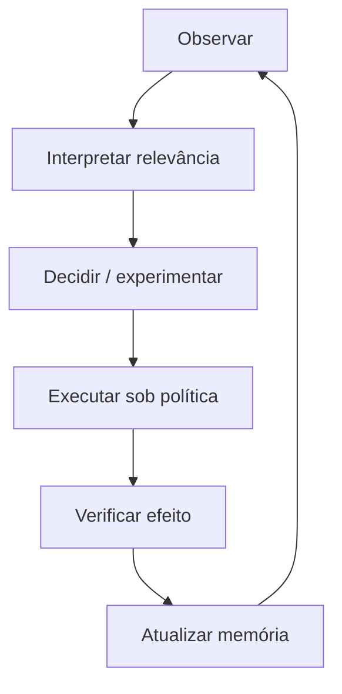
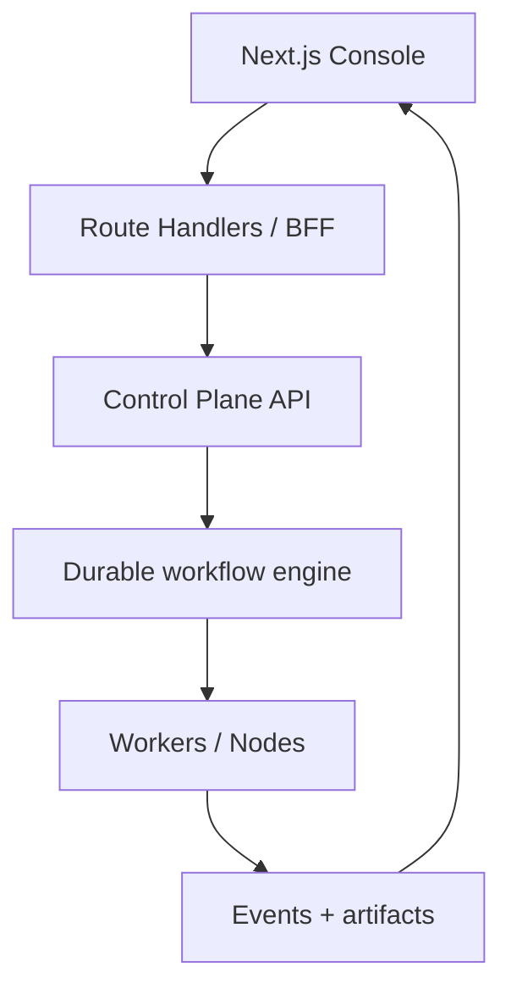

# Racional de design e ciclos de revisão

Este documento registra como a ideia mudou depois de pesquisa, análise e contestação. Ele evita que as escolhas pareçam inevitáveis ou sejam rederivadas a cada nova sessão agêntica.

## 1. Formulação inicial

> “Um sistema que monitora tecnologias e atualiza automaticamente produtos, sistemas e harnesses antes que se tornem obsoletos.”

Problemas dessa formulação:

- confunde novidade com relevância;
- trata “obsoleto” como propriedade objetiva e binária;
- pula da detecção para a mudança;
- presume que o sistema conhece intenção e restrições;
- favorece autonomia antes de verificabilidade;
- começa por sistemas existentes e exclui ideias sem código.

## 2. Formulação depois da pesquisa

> “Um ecossistema federado de inteligência de evolução que mantém contexto, observa mudanças internas e externas, calcula relevância explicável, propõe opções e experimentos, executa dentro de políticas graduais, verifica resultados e preserva memória de decisão.”

A diferença é estrutural: o produto não promete adivinhar o futuro; promete tornar a adaptação contínua, evidenciável e governável.

## 3. Revisão 1 — do radar para o loop fechado

### Evidência que mudou o desenho

- AWS Transform já implementa análise recorrente e remediação multirrepositório.
- Moderne/OpenRewrite já cobre transformação determinística em escala.
- vFunction e ferramentas de drift já observam arquitetura.
- Productboard, Dovetail e Feedly já cobrem partes dos sinais de produto e mercado.

### Conclusão

Um novo “radar de obsolescência” seria facilmente comoditizado. O diferencial precisa ser o fechamento do loop:

Resultado no pacote: `EvolutionProposal`, decision memory, experimentos, receipts e causalidade aproximada tornam-se objetos centrais, não anexos.

## 4. Revisão 2 — Skill, MCP e Module não são sinônimos

### Evidência que mudou o desenho

- Agent Skills define instruções e disclosure progressivo.
- MCP define troca de contexto e ferramentas entre host/client/server.
- SkillOps indica que bibliotecas de skills acumulam incompatibilidade, redundância e risco.
- Supply chain exige digest, assinatura, SBOM, provenance e política de ativação.

### Conclusão

A unidade instalável precisa ser maior que uma Skill e mais governada que uma conexão MCP.

| Elemento | Responsabilidade | Exemplo |
|---|---|---|
| Skill | Como raciocinar/executar uma classe de tarefa | Avaliar relevância de uma mudança tecnológica |
| MCP server | Expor tool/resource/prompt interoperável | Consultar issue tracker ou observability |
| Module | Empacotar componentes, schemas, permissões, side effects, evals, UI e provenance | Technology Scout completo |
| Profile | Escolher módulos/policies adequados a um contexto | Solo local, regulated enterprise |

Resultado no pacote: manifesto de módulo, lockfile, permission diff, quarantine, canary e rollback; Skills e MCPs entram como componentes/adapters.

## 5. Revisão 3 — autonomia longitudinal exige freios arquiteturais

### Evidência que mudou o desenho

EvoClaw mostra diferença material entre resolver tarefas independentes e preservar integridade em uma sequência de evolução. Discussões públicas também separam velocidade de PR da coerência arquitetural.

### Conclusão

- autonomia não é um boolean;
- approval pertence a um plano imutável/digest, não a uma intenção vaga;
- verificador não pode usar apenas o mesmo modelo/argumento do executor;
- todo ciclo tem budget, stop condition, checkpoint e rollback quando aplicável;
- eval longitudinal mede regressão acumulada, não só sucesso local;
- agentes não podem elevar a própria autonomia nem editar política efetiva.

Resultado no pacote: níveis A0–A5, policy ceiling, dual control, Challenger, Verifier e progressive rollout.

## 6. Por que Hub + Node

Uma arquitetura somente SaaS conflita com código, logs, pesquisa de clientes e políticas que não podem sair do ambiente. Uma arquitetura somente local perde portfolio view, governança compartilhada e inteligência entre projetos.

O compromisso é federado:

- **Hub:** identidade, registro, políticas, catálogo, portfolio, decisões e coordenação.
- **Node:** ingestão local, análise sensível, sandbox, execução, cache de policy e evidence store local.
- **Protocol:** manifests, eventos e artefatos portáveis.
- **Sync policy:** metadata-only, derived-only, artifact-approved ou full-sync.

O Node também funciona standalone. Isso evita uma versão “toy” separada: um projeto solo usa os mesmos contratos, apenas com menos serviços e política simples.

## 7. Por que começar com modular monolith + workers

O domínio ainda estará mudando. Microservices precoces transformariam hipóteses em contratos distribuídos caros.

Primeira forma recomendada:

- control plane como modular monolith com limites de domínio;
- workers separados para runs duráveis e isolados;
- PostgreSQL como system of record;
- object store para evidência e artefatos;
- outbox/inbox e CloudEvents para extração futura;
- graph/search/vector como projeções rebuildable.

Serviços são extraídos somente quando ownership, escala, blast radius, residência ou frequência de mudança justificarem.

## 8. Por que PostgreSQL é a verdade e o grafo é projeção

Relações entre projetos, evidências, decisões, capacidades e dependências são naturalmente graph-like. Porém, começar com um graph database como fonte única cria custo operacional e semântica difícil de migrar.

A decisão preserva ambos:

- integridade transacional, RLS e auditabilidade no relacional;
- queries relacionais simples por padrão;
- projeções graph para impacto, caminhos, campanhas e similaridade;
- reconstrução de projeção a partir do event log/snapshots;
- vector index apenas para recuperação semântica, nunca autoridade factual.

## 9. Por que Next.js no console, não no runtime agêntico

Next.js App Router é adequado para a experiência web e um BFF com Route Handlers. Não deve possuir execução durável, retries, leases ou workflows de horas/dias.

O console pode usar streaming para progresso, mas a verdade da run permanece no backend. Uma atualização de página jamais cancela ou duplica trabalho.

## 10. Por que “relevância”, não “obsolescência”

Uma tecnologia antiga pode ser correta; uma nova pode ser irrelevante. “Obsolescência” incentiva ansiedade e churn. Relevância é calculada contra contexto:

`relevance = evidence × exposure × strategic fit × urgency × confidence − change cost − risk`

A fórmula é conceitual, não uma pontuação universal. Cada termo deve expor inputs, origem, intervalo/uncertainty e policy. A interface mostra decomposição e contraditório; nunca apenas um número.

## 11. Por que evidência tem status epistêmico

O ecossistema separa:

| Status | Significado | Exemplo |
|---|---|---|
| Declared | Intenção ou regra explicitada por autoridade | “Dados restricted ficam locais” |
| Observed | Medição ou fato obtido de uma fonte | “A dependência está na versão 3.1” |
| Inferred | Conclusão probabilística/analítica | “A migração pode reduzir custo” |
| Expected | Estado futuro ou resultado desejado | “MTTR cairá 20%” |
| Unknown | Lacuna explícita | “Ainda não sabemos quem decide” |

Contradições não são apagadas por merge. Elas viram objetos a reconciliar. Essa escolha é o antídoto para confiança falsa em dashboards.

## 12. Por que arquitetura declarada e observada coexistem

CALM ou outro architecture-as-code representa intenção. Telemetria, código e infraestrutura representam realidade observada. Nenhum deve sobrescrever o outro.

- `declared`: o que deveria existir;
- `observed`: o que existe segundo sensores e janela temporal;
- `inferred`: estrutura deduzida com confidence;
- `drift`: diferença tipada entre versões e ambientes;
- `exception`: desvio aceito com owner e expiry.

O objetivo não é “zerar drift”, mas distinguir evolução deliberada, exceção temporária e erosão não percebida.

## 13. Por que o primeiro wedge é estreito

Embora a visão seja horizontal, o primeiro produto precisa provar valor em um loop mensurável:

> registrar um projeto/repositório, construir snapshot, detectar mudança material em dependência/harness/arquitetura, criar proposta evidenciada, executar experimento seguro e verificar resultado.

Não entram no primeiro wedge:

- marketplace público;
- autonomia A4/A5;
- otimização global de portfólio;
- previsão financeira sofisticada;
- criação completa de produto a partir de um prompt;
- ontologia universal de tecnologia.

Essa restrição evita construir uma plataforma abstrata antes de obter evidence of value.

## 14. Invariantes de design

1. Toda recomendação material cita evidência e contraditório.
2. Toda ação tem actor, policy decision, inputs, digest e receipt.
3. Todo dado derivado aponta para snapshot e transform usado.
4. Nenhum agente aumenta sua própria autoridade.
5. Nenhuma aprovação vaga autoriza um plano alterado.
6. Código e dados sensíveis permanecem locais por padrão.
7. Módulos são pinados por digest e removíveis sem apagar história.
8. Projeções podem ser reconstruídas; fatos e decisões não dependem delas.
9. Um projeto pode existir e receber valor antes de ter repositório.
10. “Não mudar” é uma decisão válida e registrada.
