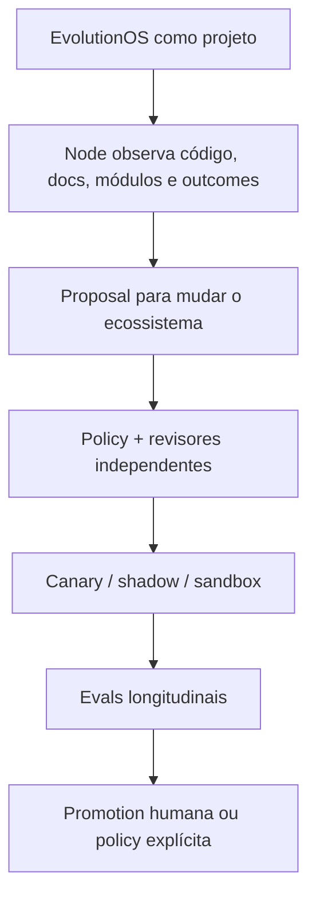

# Horizonte tecnológico e estratégia de adaptabilidade

Este documento não prevê vencedores. Ele define mudanças plausíveis, sinais a monitorar e opções arquiteturais que preservam liberdade de ação.

## 1. Princípio

Um sistema feito para combater obsolescência pode se tornar obsoleto ao cristalizar as interfaces de hoje. A defesa correta é:

- contratos pequenos e versionados;
- adaptadores substituíveis;
- dados exportáveis;
- event/artifact lineage;
- compatibility tests;
- policy independente do provider;
- decisões tecnológicas com review trigger explícito.

## 2. Horizontes

### H0 — agora: 0 a 12 meses

Concentrar em fundamentos que permanecem úteis mesmo se modelos mudarem:

- project manifest e registry;
- evidence/claim/decision/proposal;
- Node local e sync policy;
- snapshot incremental;
- evals e verification receipts;
- module manifest e capability enforcement;
- console Next.js;
- adapters SCM, CI, docs, observability e um source externo;
- workflows duráveis e auditáveis.

### H1 — expansão: 12 a 24 meses

- portfolio campaigns e dependency impact;
- private registry de módulos;
- adaptive model routing baseado em eval/cost;
- cross-project patterns sem compartilhar raw data;
- CALM import/export e architecture controls;
- A2A em integrações onde agentes pertencem a organizações/runtimes diferentes;
- policy simulation e change-impact preview;
- causal experiments e outcome attribution assistida.

### H2 — opções: 24 a 48 meses

- module/skill repair semiautônomo com promotion gates;
- organizational digital twin com confiança e freshness explícitas;
- federated analytics/privacy-preserving learning;
- negociação machine-readable de capabilities entre Nodes;
- continuous compliance evidence;
- automated retirement/consolidation campaigns;
- markets internos de modules e evidence providers.

Nada em H2 deve ser compromisso antes de H0 demonstrar valor repetido.

## 3. Sinais por domínio

| Domínio | Mudança plausível | Sinal de adoção | Opção preservada no design |
|---|---|---|---|
| Modelos | Modelos menores/especializados superam generalistas em tarefas delimitadas | Evals mostram melhor quality/cost | Provider abstraction e routing por task profile |
| Agentes | Protocolos A2A ganham interoperabilidade real | Dois runtimes externos exigem handoff verificável | Gateway adapter, sem contaminar o kernel |
| Tools | MCP evolui transport/security/discovery | Connectors convergem em MCP seguro | MCP capability proxy e version pinning |
| Skills | Skills passam a ter contracts/evals mais ricos | Ferramentas adotam metadados comuns | Module pode carregar Skills sem depender do formato para governança total |
| Runtime | Durable agent workflows viram commodity | Engines oferecem replay/leases/human tasks portáveis | Workflow port interface e event contracts |
| Arquitetura | CALM ou alternativa ganha adoção enterprise | Toolchains exportam modelos compatíveis | Adapter bidirecional e metamodelo interno neutro |
| Supply chain | Attestations para agentes/modules se tornam padrão | Registries e buyers exigem provenance | OCI/Sigstore/SPDX/SLSA candidate stack |
| Segurança | Capability-based auth e workload identity se consolidam | IdPs/secret managers suportam delegation fina | Subject/capability model separado de vendor |
| Dados | Regras de residência e IA aumentam | Clientes proíbem embeddings/raw sync | Node local, derived-only e policy por classificação |
| Evals | Evals longitudinais substituem benchmarks isolados | Tooling mede regression accumulation | Evolution Scenario Suite e milestone DAGs |

## 4. Evolução do próprio EvolutionOS

O ecossistema deve ser seu primeiro projeto monitorado, sem permitir autoaprovação.

Guardrails:

- governance repo e eval baselines protegidos;
- agent que propõe não aprova nem promove;
- change set não altera o verificador que o julga;
- rollback testado antes de promotion material;
- telemetry/evidence do self-cycle acessível para auditoria;
- autoevolução limitada inicialmente a propostas e experimentos A2.

## 5. Como revisar ADRs no tempo

Cada ADR relevante precisa de trigger, não só data.

| ADR/decisão | Review trigger |
|---|---|
| Modular monolith | Escala, ownership ou blast radius comprovadamente incompatível |
| PostgreSQL + graph projection | Queries críticas não atingem SLO apesar de otimização/projeção |
| Next.js console/BFF | Requisito de client/runtime que App Router não atende sem acoplamento impróprio |
| OCI module packaging | Spike falha em UX, multi-artefato ou policy requirements |
| CALM adapter | Adoção do cliente ou perda de compatibilidade material |
| OPA implementation | Policy requirements excedem expressividade/operability aceitável |
| MCP adapter | Versão/security model muda ou outro padrão se torna dominante |
| A2A optional | Handoffs externos repetidos justificam interoperabilidade padronizada |

## 6. Radar não prescritivo

### Adotar como fundamentos

- evidence lineage;
- event-driven durable workflows;
- capability-based policy;
- OpenTelemetry;
- SBOM/provenance/signatures;
- eval gates;
- local-first data handling;
- declarative manifests.

### Experimentar

- CALM import/export;
- OCI artifacts para module bundles;
- A2A gateway;
- causal impact estimators;
- graph-assisted portfolio planning;
- automated skill redundancy/repair;
- WASM isolation para componentes leves.

### Observar

- marketplaces públicos de skills/MCP/modules;
- auto-modifying agents;
- synthetic organizations of agents;
- federated fine-tuning/learning;
- autonomous procurement/deprecation;
- universal agent identity/reputation.

### Evitar por enquanto

- autonomous production mutation sem independent verifier;
- uma ontologia global imutável;
- confiança baseada apenas em publisher name;
- sincronizar raw data “para usar depois”;
- reescrever runtimes e padrões sem necessidade;
- depender de um único model/tool protocol.

## 7. Métricas de adaptabilidade

- tempo para adicionar/substituir um provider;
- percentagem de dados exportáveis sem perda semântica crítica;
- percentagem de workflows reproduzíveis a partir de snapshot/digest;
- módulos atualizados sem permission expansion silenciosa;
- tempo para rebuild de cada projeção;
- decisões com review trigger executado;
- regressões detectadas antes de promotion;
- custo de migração do próprio EvolutionOS por capability;
- proporção de automações promovidas de probabilísticas para determinísticas;
- idade/freshness da evidence que sustenta cada recomendação ativa.

## 8. Tese final de longevidade

O EvolutionOS não permanece atual porque escolhe sempre a tecnologia mais nova. Ele permanece atual se consegue substituir componentes sem perder:

- identidade dos projetos;
- intenção e constraints;
- evidência e provenance;
- decisões e razões;
- resultados verificados;
- policy e accountability.

Esses são os ativos estáveis. Modelos, frameworks, agentes, bancos, protocols e dashboards são meios substituíveis.

